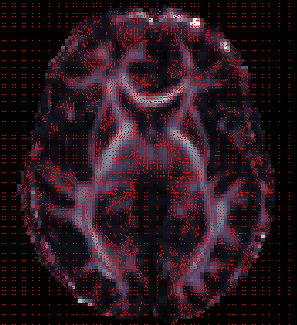
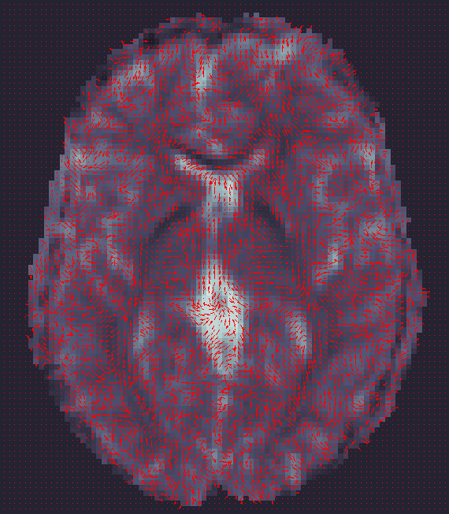
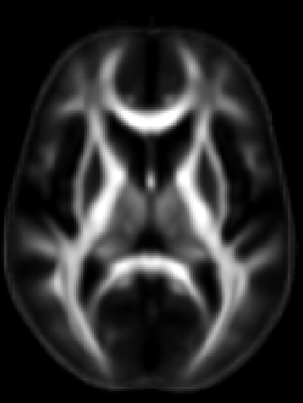
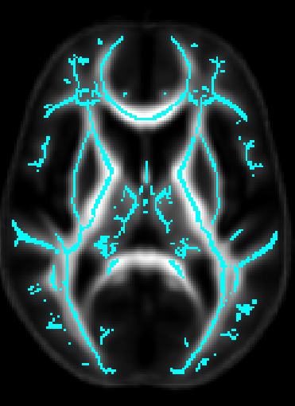
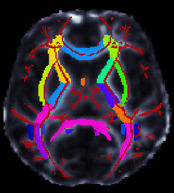
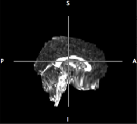
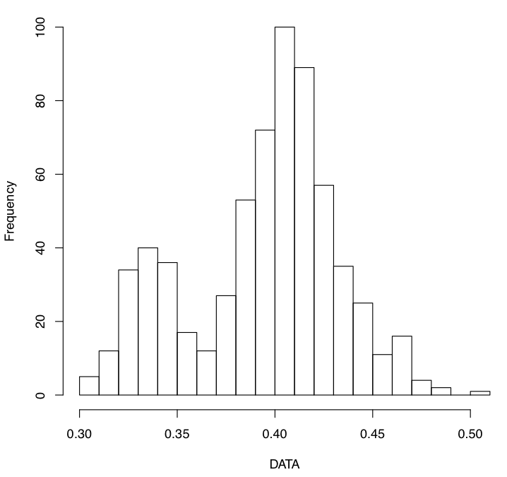

# ENIGMA DTI Protocols

**This page is intended to help guide you key steps for analyzing diffusion MRI 
while going through the standardized protocols for [ENIGMA-DTI]
(http://enigma.ini.usc.edu/ongoing/dti-working-group/)**

Please note that these protocols are subject to improvements as we get more 
feedback, so please check often for the latest!

If you find these protocols useful in your research, please provide a link to 
the ENIGMA website in your work: [enigma.ini.usc.edu](http://enigma.ini.usc.edu)
and tell us what you think! 

~ The ENIGMA-DTI Support Team~

We have a network of [DTI experts](#the-engima-dti-support-emails-are-sent-to) 
willing to help with any processing questions along the way. email 
support.enigmaDTI@ini.usc.edu with any DTI related questions!

The basic process is broken down in to 3 main categories, each with its own 
added set of quality control protocols:

*   [Preprocessing](#preprocessing)
*   [ENIGMA-DTI Processing](#enigma-dti-skeletonization)
*   [GWAS Analysis](#analysis)

---

### Preprocessing

By **preprocessing**, we are referring to converting your images from the raw 
DICOM to FA images for each subject and quality controlling along the way to 
remove scans with abnormalities and artifacts. **There can be several ways to 
pre-process your diffusion weighted data in order to maximize the quality and 
efficiency of your processing.**
We will therefore not require a specific protocol to be followed with any 
particular software, as long as the appropriate steps are performed. This will 
allow maximal integration with current pipelines and ensure optimal processing 
per site if available, and allow sites to:

1.  process data efficiently with respect to acquisition parameters (eg., do not 
    spend time on HARDI-specific algorithms if you only have 6/12 directions 
    collected)
2.  take advantage of your scanning protocols
    *   if you know you can calculate FA more robustly using one of many 
        alternate methods, go for it!
    *   maximize the quality for your scans (denoising/ removing artifacts etc.)
3.  keep things in line with current/future projects, and non ENIGMA-related 
    investigations you are working on.

If you have FA measures maps calculated and registered already, we can work with
you to include them into the Pipeline rather than to re-run everything from the 
start. Therefore, if you have discovered workflows and methods that fit your 
data well to best improve SNR, this would be ideal.

**If you have already processed your data, please email 
support.enigmaDTI@ini.usc.edu to let us know your processing workflow. Also if 
you would like to update this page with any particulars for your methods, please
let us know and we would be happy to work in additional options.**

**For those that have yet to process DTI data, various suggestions are outlined 
here. A basic series of steps are as follows:** NOTE: most of this can be done 
in multiple ways depending on your data. please do not hesitate to [contact us 
for support](mailto:support.enigmaDTI@ini.usc.edu).

1.  Convert DICOM images to DWI set and T1-weighted set and other data acquired.
    *   Determine how your DWI set(s) are organized
    *   How many many acquisitions do you have? Multiple acquisitions can be 
        merged for optimal signal-to-noise ratio.
    *   How many b0s do you have and where are they with respect to the full 
        series? (Often the b0 image(s) is/are the first volumes in the DWI set)
    *   If you have multiple b0, were they acquired with the same encoding 
        gradient? If so, slight variations in processing will be needed.
2.  Correct for Eddy Current distortions, movement using affine registration.
    *   A convenient option for this is [FSL’s “eddy_correct”]
        (http://fsl.fmrib.ox.ac.uk/fsl/fsl-4.1.9/fdt/fdt_eddy.html) command.
    *   You can use [this script to rotate your bvec files](fdt_rotate_bvecs.sh)
        (gradient directions) after using FSL’s “eddy_correct” command. (You can
        use the output of the file from now on and to create your FA images 
        (e.g. as input to [dtifit]
        (http://fsl.fmrib.ox.ac.uk/fsl/fsl4.0/fdt/fdt_dtifit.html)))
3.  Create a mask for your data.
    *   FSL’s [bet2](http://fsl.fmrib.ox.ac.uk/fsl/fsl-4.1.9/bet2/index.html) 
        offers a solution that is quite robust for many datasets.
4.  Correct for EPI induced susceptibility artifacts — this is particularly an 
    issue at higher magnetic fields.
    *   If you have two opposing b0s and a sufficient amount of diffusion 
        directions obtained, you may use FSL’s [TOPUP]
        (http://fsl.fmrib.ox.ac.uk/fsl/fslwiki/TOPUP) and [EDDY]
        (http://fsl.fmrib.ox.ac.uk/fsl/fslwiki/EDDY) for distortion correction.
    *   If a fieldmap has been collected along with your data, FSL’s 
        [FUGUE](http://fsl.fmrib.ox.ac.uk/fsl/fslwiki/FUGUE) tool may help 
        compensate for the distortions.
    *   Alternatively, a subject’s DWI images can be adjusted through high 
        dimensional warping of the b0 to a high-resolution structural (T1- or 
        T2- weighted) image of the same subject not acquired using EPI. This 
        requires multiple steps:
        *   Make sure skull-stripping has been performed on both b0 and 
            T1-weighted scans.
        *   Make sure T1-weighted scans have undergone inhomogeneity (NU) 
            correction.
        *   Make sure T1-weighted scans and the DWI are aligned!! Check for L/R
            flipping!!
        *   Linear registration of b0 of DWI and T1-weighted reference together.
            \*\*Due to differences in resolution and further registrations 
            needed throughout the workflow we recommend initially aligning 
            the T1-weighted scans to ICBM space (which is the space of the 
            ENIGMA-DTI template), then using a linear registration (with NO 
            sheering parameters) to align your b0 maps to their respective 
            T1-weighted scans in ICBM space\*\*
        *   If using FSL’s [flirt]
            (http://fsl.fmrib.ox.ac.uk/fsl/fsl-4.1.9/flirt/overview.html) for 
            linear registration, sheering can be avoided by manually setting the
            degrees of freedom (default 12) to 9 (flirt -in b0.nii.gz -out 
            b02T1w.nii.gz -df 9 -ref T1w.nii.gz)
        *   Once images are in the same space and linearly alight (visually 
            check this!), you can perform non-linear registrations to remove the
            distortion from the b0.
        *   Some possible tools include [ANTS](http://stnava.github.io/ANTs/), 
            [DTI-TK](http://dti-tk.sourceforge.net/pmwiki/pmwiki.php), or 
            [BrainSuite](http://brainsuite.org/processing/diffusion/pipeline/).
        *   The deformation fields from the warping should then be applied to 
            all volumes in the DWI.
5.  Calculate tensors (this can be done in multiple ways depending on your 
    data).
    *   Most tools will also output FA, MD, and eigenvalue and vector maps 
        simultaneously.
    *   FSL’s ‘dtifit’ command is an acceptable and convenient option. It uses 
        least-square fitting to determine the tensor and will output FA and V1 
        (primary eigenvector) needed for future analyses.

|  |  |
|---------------------------------|-------------------------------|

Directional information from the primary Eigenvector are shown. On the left the 
orientations are correct, while on the right they are incorrectly aligned (and 
overlaid on b0, not FA!).

### ENIGMA-DTI Software tools for Preprocessing Quality Control:
*   \*\*\*coming soon\*\*\* ENIGMA-DTI_QC_motion: Check for motion and slice 
    dropouts.
*   [ENIGMA-DTI_QC_FA_V1](DTI/QC/FAV1): Check vector directions (Do gradients in
    V1 align appropriately along FA image?).

Useful Tools/Tutorials/Pages:
*   [dcm2nii](http://www.mccauslandcenter.sc.edu/mricro/mricron/dcm2nii.html): 
    DICOM to NIFTI conversion
*   [FSL](http://fsl.fmrib.ox.ac.uk/fsl/fslwiki/): Many image processing tools 
    used throughout ENIGMA-DTI protocols
*   [CFARI](http://www.nitrc.org/plugins/mwiki/index.php/jist:CFARI): Many image
    processing tools useful for DTI/Q-ball processing
*   [MedINRIA](http://www-sop.inria.fr/asclepios/software/MedINRIA/): Various 
    diffusion processing tools
*   [diffusion-imaging.com](http://www.diffusion-imaging.com/): lots of 
    practical information on DTI!
*   [cabiatl](http://www.cabiatl.com/Resources/Course/tutorial/html/dti.html): 
    DTI tutorial
*   [LPCA denoising]
    (https://sites.google.com/site/pierrickcoupe/softwares/denoising-for-medical-imaging/dwi-denoising): 
    DWI denoising
*   [email me](mailto:neda.jahanshad@ini.usc.edu) to add your favorite tools 
    here.

### ENIGMA-DTI Skeletonization
Protocols \*\*NEW UPDATES\*\*

*   [ENIGMA-TBSS protocol](DTI/TBSS)
*   Once DTI data have been pre-processed, use the protocol above to map your 
    images onto the ENIGMA-DTI FA template and project the skeleton.
*   Do not forget to QC your images after FA maps have been registered! 
    Misaligned images can cause problems with the overall GWAS and are difficult
    to detect once skeletonized.
*   Use the script [here to check the values of the projection distances]
    (#easy-to-use-scripts). Make sure there are no outliers!

|  |  |  |
|-------------------------------------------|-----------------------------------|---------------------------|

Your images will be aligned to the ENIGMA-DTI template in ICBM space and mean FA
in ROIs will be extracted from the skeletal projections.

### ENIGMA-DTI Software tools for ENIGMA processing Quality Control:
*   [ENIGMA FA/Skel check](DTI/QC/FASkelcheck): Check FA Registrations and make 
    sure skeletons are correct.
*   [ENIGMA DTI SummaryStats protocol](DTI/QC/SummaryStats): Check the 
    distribution of your ROIs and look for outliers.

More DTI tools:
*   [TrackVis](http://trackvis.org/): Tractography and visualization
*   [Camino](http://cmic.cs.ucl.ac.uk/camino/index.php?n=Tutorials.DTI): 
    Tractography and DTI toolbox
*   [FSL](http://fsl.fmrib.ox.ac.uk/fsl/fslwiki/): Many image processing tools 
    used throughout ENIGMA-DTI protocols
*   [email me](mailto:neda.jahanshad@ini.usc.edu) to add your favorite tools 
    here.


### ROI extraction from FA images
*   [ENIGMA-ROI extraction protocol](DTI/ROIExtraction)
*   Use the above link to extract regions of interest from the skeletons and 
    calculate the average FA within them.
*   \*\*\*\* An important note \*\*\*\* in the analysis is that the ROI labeled 
    “IFO” is actually different that the same ROI under the most current FSL JHU
    Atlas label. This was different in the older JHU atlas used to create the 
    template and make the protocols. Please note this will not play a role in 
    ENIGMA-DTI GWAS as we will not be using this ROI for GWAS (it is very small)
    but it may be considered for disorder studies. If groups choose to use these
    measures for their own analysis, please be advised that this should be 
    **uncinate** according to the current atlas. To avoid confusion, we will NOT
    switch the labels back, but we will keep this warning so you can carefully 
    examine your data.

|  |  |
|-------------------------------------|-------------------------------|

Using the protocols above, QC your images to ensure adequate registration (not 
like the one seen above!) and normal distributions of regional values.

---

### Skeletonization of diffusivity measures including mean, axial and radial diffusivity (MD, L1, RD)

If you would like to skeletonize non-FA diffusivity measures including mean 
(MD), axial (AD/L1) and/or radial diffusivity (RD) and then extract relevant ROI
information from them according to the ENIGMA-DTI template, please follow the 
instructions provided [here](DTI/Diffusivity).

---

### Analysis

We will be performing 2 large scale GWAS:

1.  for all healthy controls and patient populations
2.  for all healthy controls only
3.  a 3rd GWAS for all patient populations without controls will be performed as
    a possible follow-up analysis

GWAS will be performed for the average FA value in the following regions of 
interest:

For samples without related individuals, associations will be run using [Mach]
(http://csg.sph.umich.edu//abecasis/MACH/tour/).

To account for relatedness within family-based datasets, we recommend and 
provide instructions for running [merlin-offline]
(http://genepi.qimr.edu.au/staff/sarahMe/merlin-offline.html) a part of the 
Merlin package [here]
(http://csg.sph.umich.edu//abecasis/Merlin/tour/assoc.html).

All related and necessary software will be downloaded as part of the scripts, so
no need to download them from here now!

Please follow the following link for access to scripts for running the GWAS:

\*\*\*coming soon\*\*\* DTI GWAS Analysis

---

### Easy to use SCRIPTS

Use this script after skeletonizing your FA images to check the mean and max 
projection distances to the skeleton:

```shell
#!/bin/sh
# Emma Sprooten for ENIGMA-DTI
# run in a new directory eg. Proj_Dist/
# create a text file containing paths to your masked FA maps
# output in Proj_Dist.txt
 
# make sure you have FSL5!!!
 
###### USER INPUTS ###############
## insert main folder where you ran TBSS
## just above "stats/" and "FA/"
maindir="/enigmaDTI/TBSS/run_tbss/"
list=`find $maindir -wholename "*/FA/*_masked_FA.nii.gz"`
 
## insert full path to mean_FA, skeleton mask and distance map
## based on ENIGMA-DTI protocol this should be:
mean_FA="/enigmaDTI/TBSS/ENIGMA_targets/mean_FA_MyMasked.nii.gz"
mask="/enigmaDTI/TBSS/ENIGMA_targets/mean_FA_skeleton_MyMasked.nii.gz"
dst_map="/enigmaDTI/TBSS/ENIGMA_targets/enigma_skeleton_mask_dst.nii.gz"
 
##############
### from here it should be working without further adjustments
 
rm Proj_Dist.txt
echo "ID" "Mean_Squared" "Max_Squared" >> Proj_Dist.txt
 
 
## for each FA map
    for FAmap in ${list}   
    do
	base=`echo $FAmap | awk 'BEGIN {FS="/"}; {print $NF}' | awk 'BEGIN \
    {FS="_"}; {print $1}'`
    dst_out="dst_vals_"$base""
 
	# get Proj Dist images
    tbss_skeleton -d -i $mean_FA -p 0.2 $dst_map \
    $FSLDIR/data/standard/LowerCingulum_1mm $FAmap $dst_out
 
	#X direction
	Xout=""squared_X_"$base"
	file=""$dst_out"_search_X.nii.gz"
	fslmaths $file -mul $file $Xout
 
	#Y direction
	Yout=""squared_Y_"$base"
	file=""$dst_out"_search_Y.nii.gz"
	fslmaths $file -mul $file $Yout
 
	#Z direction
    Zout=""squared_Z_"$base"
    file=""$dst_out"_search_Z.nii.gz"
	fslmaths $file -mul $file $Zout
 
	#Overall displacement
	Tout="Total_ProjDist_"$base""
	fslmaths $Xout -add $Yout -add $Zout $Tout
 
	# store extracted distances
	mean=`fslstats -t $Tout -k $mask -m`  
	max=`fslstats -t $Tout -R | awk '{print $2}'`
    echo "$base $mean $max" >> Proj_Dist.txt
 
    # remove X Y Z images
    ## comment out for debugging
    rm ./dst_vals_*.nii.gz
    rm ./squared_*.nii.gz
 
	echo "file $Tout done"
    done
```

### The ENGIMA DTI Support emails are sent to:

Sean Hatton (Sydney, Australia)

Neda Jahanshad (USC, CA, USA)

Sinead Kelly (Dublin, Ireland)

Peter Kochunov (U Maryland, MD, USA)

Bennett Landman (Vanderbilt, TN, USA)

Herve Lemaitre (Paris, France)

Rene Mandl (Utrecht, Netherlands)

Emma Sprooten (Yale U, CT, USA)

Chris Whelan (Dublin, Ireland)

Marcel Zwiers (Nijmegen, Netherlands)