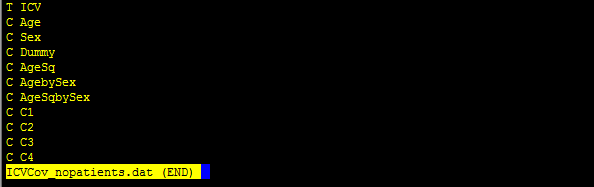
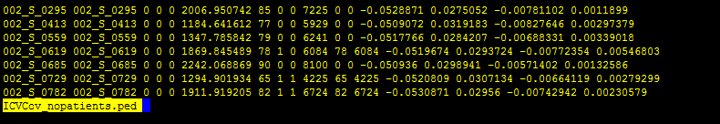
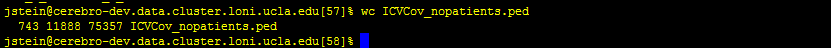
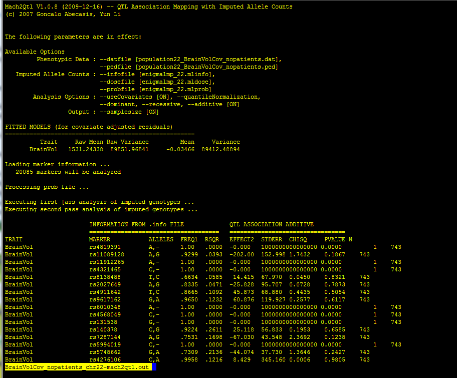

# Enigma Protocols for Association at each site using unrelated subjects – v1.1

**Written by [Sarah Medland](mailto:medlandse@gmail.com), 
[Derrek Hibar](mailto:dhibar@gmail.com), 
[Alejandro Arias Vasquez](mailto:A.AriasVasquez@psy.umcn.nl), 
and [Jason Stein](mailto:JasonLouisStein@gmail.com)**

---

**Before we start, you need to download and install some required programs 
(which you may already have). The required programs are: R, Mach, ssh client, 
mach2qtl. Links to the download sites are available below. Please address any 
questions to: enigma@lists.loni.ucla.edu.**
*   Plink can be downloaded 
    [here](http://pngu.mgh.harvard.edu/~purcell/plink/download.shtml).
*   R can be downloaded [here](http://cran.stat.ucla.edu/).
*   Mach can be downloaded 
    [here](http://www.sph.umich.edu/csg/abecasis/MACH/download/).
*   An ssh client can be downloaded 
    [here](http://www.chiark.greenend.org.uk/~sgtatham/putty/download.html) 
    (though there are many to choose from).
*   Download mach2qtl 
    [here](http://www.sph.umich.edu/csg/abecasis/MACH/download/) (run tar -zxvf 
    mach2qtl.tar.gz to decompress the files and then type "make all" in the same
    directory to build. You will then have an executable called mach2qtl that 
    you should add to your path).

---

**Compile a list of traits and covariates for all analyses to be conducted in 
the study *without patients*. This list should include hippocampal volume, ICV, 
brain volume, age, sex, age<sup>2</sup>, sex\*age, sex\*age<sup>2</sup>, 
population stratification (4 MDS components), dummy covariate for different MR 
acquisitions (if applicable). Then write out these files as Merlin compatible 
files and merge them with the genotype files.**

First, make a spreadsheet (using Excel or your favorite spreadsheet program) of 
familyID, individualID, hippocampal volume, intracranial volume, brain volume, 
age, sex, and dummy covariate(s) for different MR acquisitions (if applicable) 
excluding patients. The spreadsheet should look like this:

| FID     | IID   | HippoVol | ICV     | BrainVol | Age | Sex | Dummy |
|---------|-------|----------|---------|----------|-----|-----|-------|
| Family1 | Subj1 | 3796.87  | 1780.30 | 1483.22  | 23  | 1   | 1     |
| Family2 | Subj1 | 4023.24  | 1801.19 | 1623.33  | 25  | 0   | 1     |
| Family3 | Subj1 | 4112.24  | 1792.84 | 1554.91  | 22  | 1   | 0     |
| …       | …     | …        | …       | …        | …   | …   |       |

Make sure to have exactly the same header labels in the same order so that the 
commands below do not need to be changed. If you have no dummy covariates (or 
more than 1 dummy covariate) these commands below should still work (just add 
the extra dummy covariates to the end). Save this file as a tab delimited text 
file called `/enigma/genetics/HippoCovs_nopatients.txt`.

Then read this file into R and add some required columns of age<sup>2</sup>, 
sex*age, and sex*age<sup>2</sup>, combine with the MDS components, and write out
a .ped and .dat file to add the covariates to the current .ped and .dat files 
for each of the analyses to be conducted.

```R
R

HippoCovs = read.table(“HippoCovs_nopatients.txt”, header=T);
HippoCovs$AgeSq = HippoCovs$Age*HippoCovs$Age; #add an age2 term
HippoCovs$AgebySex = HippoCovs$Age*HippoCovs$Sex;   #add an age*sex 
                                                    #interaction term
HippoCovs$AgeSqbySex = HippoCovs$AgeSq*HippoCovs$Sex;   #add an age2*sex 
                                                        #interaction term

mds.cluster = read.table(“HM3mds2R.mds”, header=T); #Read in the MDS components
mds.cluster$SOL = NULL; #Remove the “SOL” column in the MDS components since
                        #this is not a covariate to be included

merged = merge(HippoCovs, mds.cluster, by = c("FID","IID")); #Merge the MDS and 
                                                             #other covariates
numcovs = length(colnames(merged))-4;   #Number of covariates included for 
                                        #initial analyses

#Hippo | ICV, age, sex, age2, sex*age, sex*age2, population stratification (4 
#MDS components), dummy covariate for different scanners/acquisitions
write.table(cbind(c("T",rep("C",numcovs)),
                  c(“HippoVol”,”ICV”,colnames(merged)[6:(numcovs+4)])),
            "HippoCov_ICV_nopatients.dat",col.names=F,
            row.names=F,quote=F); #Create a HippoCov_ICV_nopatients.dat file
            
pedfile=as.data.frame(c(merged[1:2],rep(0,length(merged[1])),
                        rep(0,length(merged[1])),rep(0,length(merged[1])),
                        merged[3:4],merged[6:(numcovs+4)]));    
                        #Create a HippoCov_ICV_nopatients.ped variable
                        
write.table(pedfile,"HippoCov_ICV_nopatients.ped",quote=F,col.names=F,
            row.names=F); #Write a HippoCov_ICV_nopatients.ped file

#Hippo | BrainVol, age, sex, age2, sex*age, sex*age2, population stratification 
#(4 MDS components), dummy covariate for different scanners/acquisitions
write.table(cbind(c("T",rep("C",numcovs)),
                  c(“HippoVol”,”BrainVol”,colnames(merged)[6:(numcovs+4)])),
            "HippoCov_BrainVol_nopatients.dat",col.names=F,
            row.names=F,quote=F);   #Create a #HippoCov_BrainVol_nopatients.dat 
                                    #file
                                    
pedfile=as.data.frame(c(merged[1:2],rep(0,length(merged[1])),
                        rep(0,length(merged[1])),rep(0,length(merged[1])),
                        merged[3],
                        merged[5],merged[6:(numcovs+4)])); 
                        #Create a HippoCov_BrainVol_nopatients.ped file
                        
write.table(pedfile,"HippoCov_BrainVol_nopatients.ped",quote=F,col.names=F,
            row.names=F); #Write a HippoCov_BrainVol_nopatients.ped file

#Hippo | age, sex, age2, sex*age, sex*age2, population stratification (4 MDS
#components), dummy covariate for different scanners/acquisitions
write.table(cbind(c("T",rep("C",numcovs-1)),
                  c(“HippoVol”,colnames(merged)[6:(numcovs+4)])),
            "HippoCov_nopatients.dat",col.names=F,
            row.names=F,quote=F); #Create a HippoCov_nopatients.dat file
            
pedfile=as.data.frame(c(merged[1:2],rep(0,length(merged[1])),
                      rep(0,length(merged[1])),rep(0,length(merged[1])),
                      merged[3],merged[6:(numcovs+4)])); 
                      #Create a HippoCov_nopatients.ped file

write.table(pedfile,"HippoCov_nopatients.ped",quote=F,col.names=F,row.names=F); 
            #Write a HippoCov_nopatients.ped file

#ICV | age, sex, age2, sex*age, sex*age2, population stratification (4 MDS 
#components), dummy covariate for different scanners/acquisitions
write.table(cbind(c("T",rep("C",numcovs-1)),
                  c(“ICV”,colnames(merged)[6:(numcovs+4)])),
            "ICVCov_nopatients.dat",col.names=F,row.names=F,quote=F); 
            #Create a ICVCov_nopatients.dat file
    
pedfile=as.data.frame(c(merged[1:2],rep(0,length(merged[1])),
                        rep(0,length(merged[1])),rep(0,length(merged[1])),
                        merged[4],merged[6:(numcovs+4)])); 
                        #Create a ICVCov_nopatients.ped file
    
write.table(pedfile,"ICVCov_nopatients.ped",quote=F,col.names=F,row.names=F); 
            #Write a ICVCov_nopatients.ped file

#BrainVol | age, sex, age2, sex*age, sex*age2, population stratification (4 MDS 
#components), dummy covariate for different scanners/acquisitions
write.table(cbind(c("T",rep("C",numcovs-1)),
                  c(“BrainVol”,colnames(merged)[6:(numcovs+4)])),
            "BrainVolCov_nopatients.dat",col.names=F,row.names=F,quote=F); 
            #Create a BrainVolCov_nopatients.dat file
            
pedfile=as.data.frame(c(merged[1:2],rep(0,length(merged[1])),
                        rep(0,length(merged[1])),rep(0,length(merged[1])),
                        merged[5],merged[6:(numcovs+4)])); 
                        #Create a BrainVolCov_nopatients.ped file
                        
write.table(pedfile,"BrainVolCov_nopatients.ped",quote=F,col.names=F,
            row.names=F); #Write a BrainVolCov_nopatients.ped file
```

---

**Check the files you just produced to make sure they have the correct 
information. There was a lot of text manipulation we just did, so please make 
sure to look at the files you created to see if they have the correct number of 
subjects, correct columns, and correct .dat files.**

Here is an example of the ICVCov_nopatients.dat file:

```bash
less ICVCov_nopatients.dat
```



Here is an example of the ICVCov_nopatients.ped file (all the data is fake):

```bash
less ICVCov_nopatients.ped
```



Check that the file has the same number of rows as subjects:

```bash
wc ICVCov_nopatients.ped
```



In this case 743 subjects are contained in the .ped file.

Please check all the rest of the files to make sure they have the correct 
information.

---

**Add the covariates to the .ped file and run the association on each 
chromosome. First create a .dat file for the population.ped files, then merge 
with the covariate files generated above, then run mach2qtl.**

```bash
for x in `seq 1 22`
    do
    echo "S1 dummy_phenotype" > population${x}.dat
    awk '{print "M", $2}' population${x}.map >> \
    population${x}.dat  #Creates a .dat file for each population.ped 
                        #chromosome file
    for reg in HippoCov_ICV_nopatients HippoCov_BrainVol_nopatients \
    HippoCov_nopatients ICVCov_nopatients BrainVolCov_nopatients
        do
        pedmerge ${reg} population${x} population${x}_${reg}
        mach2qtl --datfile population${x}_${reg}.dat \
        --pedfile population${x}_${reg}.ped \
        --infofile enigmalmp_${x}.mlinfo --dosefile enigmalmp_${x}.mldose \
        --probfile enigmalmp_${x}.mlprob --samplesize > \
        ${reg}_chr${x}-mach2qtl.out #Perform the association on the 
                                    #imputed data
    done
done
```

**Compile a list of traits and covariates for all analyses to be conducted in 
the study *with all subjects including patients*. This list should include 
hippocampal volume, ICV, brain volume, sex, age, age<sup>2</sup>, sex*age, 
sex*age<sup>2</sup>, population stratification (4 MDS components), dummy 
covariate for different MR acquisitions (if applicable). Then write out these 
files as Merlin compatible files and merge them with the genotype files.**

This is basically a repeat of the previous section (just including patients 
now). First, make a spreadsheet (using Excel or your favorite spreadsheet 
program) of familyID, individualID, hippocampal volume, intracranial volume, 
brain volume , age, sex, and dummy covariate(s) for different MR acquisitions 
including patients. The spreadsheet should look like this:

| FID     | IID   | HippoVol | ICV     | BrainVol | Age | Sex | Dummy |
|---------|-------|----------|---------|----------|-----|-----|-------|
| Family1 | Subj1 | 3796.87  | 1780.30 | 1483.22  | 23  | 1   | 1     |
| Family2 | Subj1 | 4023.24  | 1801.19 | 1623.33  | 25  | 0   | 1     |
| Family3 | Subj1 | 4112.24  | 1792.84 | 1554.91  | 22  | 1   | 0     |
| …       | …     | …        | …       | …        | …   | …   |       |

Make sure to have exactly the same header labels in the same order so that the 
commands below do not need to be changed. If you have no dummy covariates (or 
more than 1 dummy covariate) these commands below should still work (just add 
the extra dummy covariates to the end). Save this file as a tab delimited text 
file called `/enigma/genetics/HippoCovs_wpatients.txt`.

Then read this file into R and add some required columns of age<sup>2</sup>, 
sex*age, and sex*age<sup>2</sup>, combine with the MDS components, and write out
a .ped and .dat file to add the covariates to the current .ped and .dat files.

```R
R
HippoCovs = read.table(“HippoCovs_wpatients.txt”, header=T);
HippoCovs$AgeSq = HippoCovs$Age*HippoCovs$Age; #add an age2 term
HippoCovs$AgebySex = HippoCovs$Age*HippoCovs$Sex;   #add an age*sex interaction 
                                                    #term
HippoCovs$AgeSqbySex = HippoCovs$AgeSq*HippoCovs$Sex;   #add an age2*sex 
                                                        #interaction term

mds.cluster = read.table(“HM3mds2R.mds”, header=T); #Read in the MDS components
mds.cluster$SOL = NULL; #Remove the “SOL” column in the MDS components since 
                        #this is not a covariate to be included

merged = merge(HippoCovs, mds.cluster, by = c("FID","IID"));    #Merge the MDS 
                                                                #and other 
                                                                #covariates
numcovs = length(colnames(merged))-4;   #Number of covariates included for 
                                        #initial analyses

#Hippo | ICV, age, sex, age2, sex*age, sex*age2, population stratification (4 
#MDS components), dummy covariate for different scanners/acquisitions
write.table(cbind(c("T",rep("C",numcovs)),
                  c(“HippoVol”,”ICV”,colnames(merged)[6:(numcovs+4)])),
            "HippoCov_ICV_wpatients.dat",col.names=F,row.names=F,quote=F); 
            #Create a HippoCov_ICV_wpatients.dat file

pedfile=as.data.frame(c(merged[1:2],rep(0,length(merged[1])),
                        rep(0,length(merged[1])),rep(0,length(merged[1])),
                        merged[3:4],merged[6:(numcovs+4)])); 
                        #Create a HippoCov_ICV_wpatients.ped variable
                        
write.table(pedfile,"HippoCov_ICV_wpatients.ped",quote=F,col.names=F,
            row.names=F); #Write a HippoCov_ICV_wpatients.ped file

#Hippo | BrainVol, age, sex, age2, sex*age, sex*age2, population stratification 
#(4 MDS components), dummy covariate for different scanners/acquisitions
write.table(cbind(c("T",rep("C",numcovs)),
                  c(“HippoVol”,”BrainVol”,colnames(merged)[6:(numcovs+4)])),
            "HippoCov_BrainVol_wpatients.dat",col.names=F,row.names=F,quote=F);
            #Create a HippoCov_BrainVol_wpatients.dat file
            
pedfile=as.data.frame(c(merged[1:2],rep(0,length(merged[1])),
                rep(0,length(merged[1])),rep(0,length(merged[1])),
                merged[3],merged[5],merged[6:(numcovs+4)]));
                #Create a HippoCov_BrainVol_wpatients.ped file
                
write.table(pedfile,"HippoCov_BrainVol_wpatients.ped",quote=F,col.names=F,
            row.names=F); #Write a HippoCov_BrainVol_wpatients.ped file

#Hippo | age, sex, age2, sex*age, sex*age2, population stratification (4 MDS 
#components), dummy covariate for different scanners/acquisitions
write.table(cbind(c("T",rep("C",numcovs-1)),
                  c(“HippoVol”,colnames(merged)[6:(numcovs+4)])),
            "HippoCov_wpatients.dat",col.names=F,row.names=F,quote=F); 
            #Create a HippoCov_wpatients.dat file
            
pedfile=as.data.frame(c(merged[1:2],rep(0,length(merged[1])),
                        rep(0,length(merged[1])),rep(0,length(merged[1])),
                        merged[3],merged[6:(numcovs+4)])); 
                        #Create a HippoCov_wpatients.ped file
                        
write.table(pedfile,"HippoCov_wpatients.ped",quote=F,col.names=F,row.names=F); 
            #Write a HippoCov_wpatients.ped file
```

---

**Add the covariates to the .ped file and run the association on each 
chromosome**

First create a .dat file for the population.ped files, then merge with the 
covariate files generated above, then run mach2qtl.

```bash
for x in `seq 1 22`
    do
    for reg in HippoCov_ICV_wpatients HippoCov_BrainVol_wpatients \
    HippoCov_wpatients
        do
        pedmerge ${reg} population${x} population${x}_${reg}
        mach2qtl --datfile population${x}_${reg}.dat --pedfile \
        population${x}_${reg}.ped --infofile enigmalmp_${x}.mlinfo \
        --dosefile enigmalmp_${x}.mldose --probfile enigmalmp_${x}.mlprob \
        --samplesize > ${reg}_chr${x}-mach2qtl.out  #Perform the association
                                                    #on the imputed data
    done
done
```

---

**Visually check the results files. If the program errors, you will be able to 
tell by looking at the results files.**

```bash
less *mach2qtl.out
```



The results files should look something like this. (Disregard the actual numbers
because this is done on fake data). If there is an error and you need help, 
please send an email to enigma@lists.loni.ucla.edu with the message.

---

**Compiling the results for upload to the LONI servers**

```bash
#Compress the .mlinfo files and prepare to send to LONI servers.
tar czvf enigmalmp_allchr.mlinfo.tar.gz \
enigmalmp_*.mlinfo  #This will create a file called 
                    #enigmalmp_allchr.mlinfo.tar.gz that should be uploaded 
                    #to the server.
#Compress the association results files and prepare to send to LONI servers.
for reg in HippoCov_ICV_nopatients HippoCov_BrainVol_nopatients \
HippoCov_nopatients ICVCov_nopatients BrainVolCov_nopatients \
HippoCov_ICV_wpatients HippoCov_BrainVol_wpatients HippoCov_wpatients
    do
    tar czvf ${reg}_allchr.mach2qtl.tar.gz \
    ${reg}_chr*-mach2qtl.out    #This will create a file of all the GWAS 
                                #results for each analysis that will be sent
                                #to LONI servers
done
```

---

**Upload results to LONI servers**

*Note: This section is out of date*

Please upload everything here: http://enigma.loni.ucla.edu/meta-analysis/. You 
will need to upload the 9 files that you just created here:

1.  enigmalmp_allchr.mlinfo.tar.gz
2.  HippoCov_ICV_nopatients _allchr.mach2qtl.tar.gz
3.  HippoCov_BrainVol_nopatients_allchr.mach2qtl.tar.gz
4.  HippoCov_nopatients_allchr.mach2qtl.tar.gz
5.  ICVCov_nopatients_allchr.mach2qtl.tar.gz
6.  BrainVolCov_nopatients_allchr.mach2qtl.tar.gz
7.  HippoCov_ICV_wpatients_allchr.mach2qtl.tar.gz
8.  HippoCov_BrainVol_wpatients_allchr.mach2qtl.tar.gz
9.  HippoCov_wpatients_allchr.mach2qtl.tar.gz

In addition there will be other files to upload on the site.
