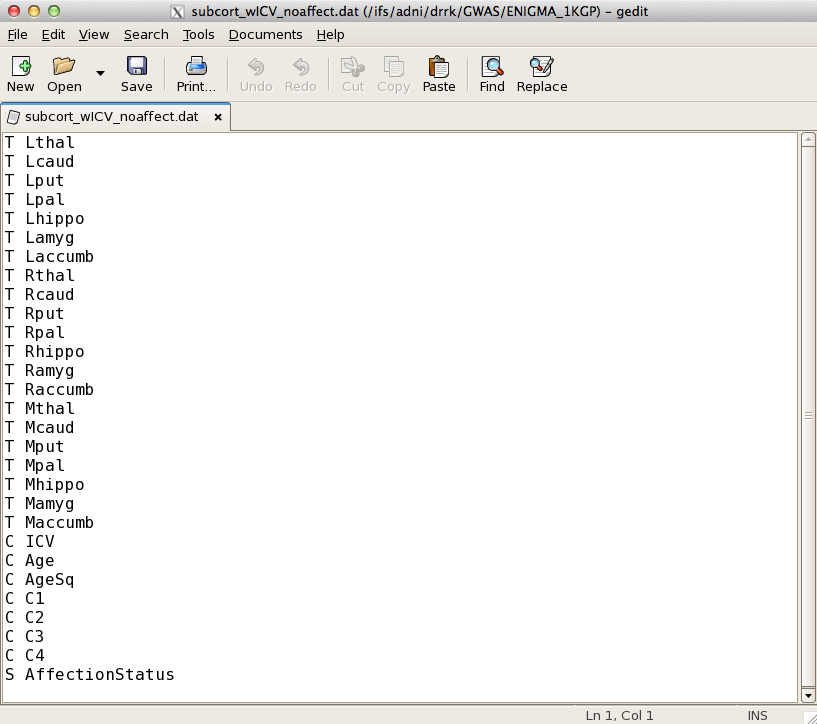

# ENIGMA2 

**Protocol For Association Testing Using Unrelated Subjects in Cohorts with 
Patients**

**Written by Miguel E. Rentería, Derrek Hibar, Alejandro Arias Vasquez, Jason 
Stein and Sarah Medland**

**Before we start, you need to download and install some required programs 
(which you may already have). The required programs are: R, ssh client, 
mach2qtl. Links to the download sites are available below. Please address any 
questions to: enigma2helpdesk@gmail.com.**

*   R can be downloaded [here](http://cran.stat.ucla.edu/).
*   An ssh client can be downloaded 
    [here](http://www.chiark.greenend.org.uk/~sgtatham/putty/download.html) 
    (though there are many to choose from).
*   Download mach2qtl 
    [here](http://www.sph.umich.edu/csg/abecasis/MACH/download/) (run tar -zxvf 
    mach2qtl.tar.gz to decompress the files and then type "make all" in the same
    directory to build. You will then have an executable called mach2qtl that 
    you should add to your path.)
    
**The following protocol can be split into three general categories based on 
cohort type. If you have a sample of unrelated, healthy subjects please follow 
the directions under Method A. If you have a sample of unrelated subjects with a
mix of healthy controls and diagnosed patients please follow Method B. If you 
have a sample of related individuals, please follow Method C.**

### Method B: Protocol for groups with patients

You will need three files to run the association analysis (described below). We 
recommend you keep these files into your working directory. Please, make sure to
have exactly the same header labels and in the same order as shown below so that
the commands used in this protocol need not to be changed:

*   `LandRvolumes.csv` Which contains your imaging phenotypes (after quality 
    control) for the entire sample *including patients*. Make sure that the 
    SubjectID’s in this file are in the proper format (i.e. that they match the 
    format of the individual subject ID’s given in the IID column of the 
    `SubCortCovs_havepatients.csv` file).
    *   Make sure that missing values and individual volume measures that were 
        excluded from the analysis during QC in the LandRvolumes.csv are coded 
        as “NA” without the quotes. Note that we originally suggested marking 
        these values with an “x” in the imaging protocol. The following R 
        scripts handle excluded values better if they are marked with NA. 
        *Please do a “find and replace” in your favorite text editor for “x” and
        replace it with “NA” (again all without quotes).*
    *   **FSL FIRST Users:** The ICV values reported in your LandRvolumes.csv 
        file are actually just ratios, in order to convert it to a volume 
        measurement (and make it comparable to the ICV measure given in 
        FreeSurfer) you need to multiply each value by the template volume. *If 
        you used the default template in FSL FIRST (most likely this is true of 
        everyone) then multiply each value in the ICV column by 1827243.* You 
        can do this easily in a spreadsheet program like Excel or on the Linux 
        command line using awk (remember to save it back as a CSV file).
    
**NOTE (1):** Missing values in both files: `SubCortCovs_havepatients.csv` and 
`LandRvolumes.csv` must be coded as “NA” (without the quotation marks → “ “). 
The spreadsheet should look like this:

| SubjID | Lthal | Rthal | Lcaud | Rcaud | Lput | Rput | Lpal | Rpal | Lhippo | Rhippo | Lamyg | Ramyg | Laccumb | Raccumb | ICV |
|--------|-------|-------|-------|-------|------|------|------|------|--------|--------|-------|-------|---------|---------|-----|
| Subj1  | …     | …     | …     | …     | …    | …    | …    | …    | …      | …      | …     | …     | …       | …       | …   |
| Subj2  | …     | …     | …     | …     | …    | …    | …    | …    | …      | …      | …     | …     | …       | …       | …   |

*   `SubCortCovs_havepatients.csv` A spreadsheet generated using Excel or your 
    favourite spreadsheet program, which contains the following columns: 
    Family ID, Individual ID, age, sex, affection status (i.e. patient=1, 
    control=0), and dummy covariates: i.e. a covariate to control for different 
    MR acquisitions, if applicable, *including patients*. Save this spreadsheet 
    as a comma delimited (.csv) text file called `SubCortCovs_havepatients.csv`.
    The spreadsheet should look like this:

| FID  | IID   | Age | Sex | AffectionStatus | Dummy1… | Dummy2… |
|------|-------|-----|-----|-----------------|---------|---------|
| Fam1 | Subj1 | …   | …   | …               | …       | …       |
| Fam2 | Subj1 | …   | …   | …               | …       | …       |

**NOTE (2):** Sex must be specified as follows: (Males=1, Females=2), and “FID” 
and “IID” should be named exactly the same in all files; Likewise, for the 
protocol to run smoothly without requiring additional changes, please name the 
affection status column as **AffectionStatus**, and fill it in with values of 1 
and 0 (patient=1 and control=0).

*   The third file is `HM3mds2R.mds.csv` (a spreadsheet containing the following
    columns: individual ID (IID), 4 MDS components (C1, C2, C3 and C4), and 
    PLINK’s assigned solution code (SOL).

| FID  | IID   | SOL | C1 | C2 | C3 | C4 |
|------|-------|-----|----|----|----|----|
| Fam1 | Subj1 | …   | …  | …  | …  | …  |
| Fam2 | Subj2 | …   | …  | …  | …  | …  |

**NOTE (3):** If you have no dummy covariates (or more than 1 dummy covariate) 
the commands below should still work (just add the extra dummy covariates to the
end and modify the code where indicated in red).

These three files: `LandRvolumes.csv`, `SubCortCovs_havepatients.csv` and 
`HM3mds2R.mds.csv` will be read into R to generate PED and DAT files that will 
be used for association with mach2qtl.

---

The following R script assumes your files are all kept in the same folder, which
is also the working directory of R.

```R
R
getwd() #Check that you are in the correct directory
SubCort <- read.table("LandRvolumes.csv", 
                      colClasses=c("character", rep("numeric",15)), sep=",", 
                      header=T); #Read in the phenotypes file
Covs <- read.table("SubCortCovs_havepatients.csv", 
                   colClasses=c(rep("character",2), rep("numeric",3)), sep=",", 
                   header=T); #Read in the covariates file
SubCort$IID = SubCort$SubjID #This just renames a column for easier merging
SubCort$SubjID = NULL
SubCortCovs <- merge(SubCort, Covs, by="IID"); #Merge into a single dataframe

SubCortCovs$AgeSq <- SubCortCovs$Age*SubCortCovs$Age; #add an age^2 term
SubCortCovs$Mthal <- 
    rowMeans(SubCortCovs[,c("Lthal","Rthal")]); #calculate mean Thalamus
SubCortCovs$Mcaud <- 
    rowMeans(SubCortCovs[,c("Lcaud","Rcaud")]); #calculate mean Caudate
SubCortCovs$Mput <- 
    rowMeans(SubCortCovs[,c("Lput","Rput")]); #calculate mean Putamen
SubCortCovs$Mpal <- 
    rowMeans(SubCortCovs[,c("Lpal","Rpal")]); #calculate mean Pallidum
SubCortCovs$Mhippo <- 
    rowMeans(SubCortCovs[,c("Lhippo","Rhippo")]); #calculate mean Hippocampus
SubCortCovs$Mamyg <- 
    rowMeans(SubCortCovs[,c("Lamyg","Ramyg")]); #calculate mean Amygdala
SubCortCovs$Maccumb <- 
    rowMeans(SubCortCovs[,c("Laccumb","Raccumb")]); #calculate mean Accumbens

mds.cluster <- read.table("HM3mds2R.mds.csv", colClasses=c(rep("character",2), 
                          rep("numeric",5)), sep=",", 
                          header=T); #Read in the MDS components
mds.cluster$SOL <- NULL; #Remove the “SOL” column in the MDS components since 
                         #this is not a covariate to be included
merged_temp <- merge(SubCortCovs, mds.cluster, 
                     by=c("FID","IID")); #Merge the MDS and other covariates

merged_ordered <- merged_temp[,c("FID", "IID", "Sex", "Lthal", "Lcaud", "Lput", 
                                 "Lpal", "Lhippo", "Lamyg", "Laccumb", "Rthal", 
                                 "Rcaud", "Rput", "Rpal", "Rhippo", "Ramyg", 
                                 "Raccumb", "Mthal", "Mcaud", "Mput", "Mpal", 
                                 "Mhippo", "Mamyg", "Maccumb", "ICV", "Age", 
                                 "AgeSq", "C1", "C2", "C3", "C4", 
                                 "AffectionStatus")]
#Create an ordered data frame with left and hemisphere volumes, as well as mean 
#volumes and covariates. If you have additional dummy covariates to accommodate 
#different scanners you will need to modify this command in order to work 
#properly. For an example, see below:
#merged_ordered <- merged_temp[,c("FID", "IID", "Sex", "Lthal","Lcaud", "Lput", 
#                                 "Lpal", "Lhippo", "Lamyg", "Laccumb", "Rthal",
#                                 "Rcaud", "Rput", "Rpal", "Rhippo", "Ramyg", 
#                                 "Raccumb", "Mthal","Mcaud", "Mput", "Mpal", 
#                                 "Mhippo", "Mamyg", "Maccumb", "ICV","Age", 
#                                 "AgeSq", "C1", "C2", "C3", "C4", 
#                                 "AffectionStatus", "Dummy1", "Dummy2"...)]

numcovs <- length(colnames(merged_ordered))-24; 
#Number of Covariates(ICV, age, age2, population stratification (4 MDS 
#components), dummy covariate for different scanners/acquisitions).

merged_ordered[,1:(24+numcovs)][is.na(merged_ordered[,1:(24+numcovs)])] <- 
    "x" #recode "NAs" into "x", to comply with required association format

## * * * * * * * * * * * * * * * * * * * * * * * * * * * * * * * * * * * * * ##
##Create three PED files containing 21 traits (7 x Left, 7 x Right and 7 x Mean 
#Hemispheric Volumes)for the different combined-sexes analyses: Males+Females 
#patients/controls combined, Males+Females patients only, Males+Females controls
#only.
## * * * * * * * * * * * * * * * * * * * * * * * * * * * * * * * * * * * * * ##

merged_MF_ordered_combined <- merged_ordered; #Create a Males+Females variable

merged_MF_ordered_combined$Sex -> 
    merged_MF_ordered_combined$SexPED; #Rename Sex column as SexPED Variable

merged_MF_ordered_combined$SexPED -> 
    merged_MF_ordered_combined$Sex; #Create a SexCOV Variable

merged_MF_ordered_combined$Sex[merged_MF_ordered_combined$Sex==1] <- 
    0; #recode males from "1" into "0", in the sex covariate.
merged_MF_ordered_combined$Sex[merged_MF_ordered_combined$Sex==2] <- 
    1; #recode females from "2" into "1", in the sex covariate.

merged_MF_ordered_combined <- 
    merged_MF_ordered_combined[,c("FID", "IID", "SexPED", "Lthal", "Lcaud", 
                                  "Lput", "Lpal", "Lhippo", "Lamyg", "Laccumb", 
                                  "Rthal", "Rcaud", "Rput", "Rpal", "Rhippo", 
                                  "Ramyg", "Raccumb", "Mthal", "Mcaud", "Mput", 
                                  "Mpal", "Mhippo", "Mamyg", "Maccumb", "ICV", 
                                  "Age", "Sex", "AgeSq", "C1", "C2", "C3", "C4",
                                  "AffectionStatus")] 
#Create an ordered data frame with left and hemisphere volumes, as well as mean 
#volumes and covariates. If you have additional dummy covariates to accommodate 
#different scanners you will need to modify this command in order to work 
#properly. For an example, see below:
#merged_ordered <- 
#   merged_temp[,c("FID", "IID", "Sex", "Lthal","Lcaud", "Lput", "Lpal", 
#                  "Lhippo", "Lamyg", "Laccumb", "Rthal","Rcaud", "Rput", 
#                  "Rpal", "Rhippo", "Ramyg", "Raccumb", "Mthal","Mcaud", 
#                  "Mput", "Mpal", "Mhippo", "Mamyg", "Maccumb", "ICV","Age", 
#                  "AgeSq", "C1", "C2", "C3", "C4", "AffectionStatus", "Dummy1",
#                  "Dummy2"...)]

pedfile=as.data.frame(c(merged_MF_ordered_combined[1:2],
                        rep(0,length(merged_MF_ordered_combined[1])),
                        rep(0,length(merged_MF_ordered_combined[1])),
                        merged_MF_ordered_combined[3:24],
                        merged_MF_ordered_combined[25:(numcovs+25)])); 
#Create a pedfile variable containing all individuals in the sample.

write.table(pedfile,"MalesFemales_subcortCov_combined.ped",quote=F,col.names=F,
    row.names=F); #Write out MalesFemales_subcortCov_patientsonly.ped file

merged_MF_ordered_havepatients <- subset(merged_MF_ordered_combined, 
    AffectionStatus==1); #Create a PATIENTS ONLY Subset
merged_MF_ordered_havepatients$AffectionStatus <- NULL
pedfile=as.data.frame(c(merged_MF_ordered_havepatients[1:2],
                        rep(0,length(merged_MF_ordered_havepatients[1])),
                        rep(0,length(merged_MF_ordered_havepatients[1])),
                        merged_MF_ordered_havepatients[3:24],
                        merged_MF_ordered_havepatients[25:(numcovs+24)])); 
#Create a pedfile variable containing patients only.

write.table(pedfile,"MalesFemales_subcortCov_patientsonly.ped",quote=F,
            col.names=F,row.names=F); 
#Write out MalesFemales_subcortCov_patientsonly.ped file

merged_MF_ordered_nopatients <- 
    subset(merged_MF_ordered_combined, 
           AffectionStatus==0); #Create a CONTROLS ONLY Subset
merged_MF_ordered_nopatients$AffectionStatus <- NULL
pedfile=as.data.frame(c(merged_MF_ordered_nopatients[1:2],
                        rep(0,length(merged_MF_ordered_nopatients[1])),
                        rep(0,length(merged_MF_ordered_nopatients[1])),
                        merged_MF_ordered_nopatients[3:24],
                        merged_MF_ordered_nopatients[25:(numcovs+24)])); 
#Create a pedfile variable containing Controls only.

write.table(pedfile,"MalesFemales_subcortCov_nopatients.ped",quote=F,
            col.names=F,row.names=F); 
#Write out MalesFemales_subcortCov_nopatients.ped file

##Create six DAT files: With and without ICV as a Covariate including ALL 
##Volumes, Left, Right and Mean (and two more versions of the same files that 
##include affection status)##
## * * * * * * * * * * * * * * * * * * * * * * * * * * * * * * * * * * * * * ##

##Without ICV and no affection status
write.table(cbind(c(rep("T",21),"S",rep("C",(numcovs-1))),
                  c("Lthal","Lcaud","Lput","Lpal","Lhippo","Lamyg","Laccumb",
                    "Rthal","Rcaud","Rput","Rpal","Rhippo","Ramyg","Raccumb",
                    "Mthal","Mcaud","Mput","Mpal","Mhippo","Mamyg","Maccumb",
                    colnames(merged_MF_ordered_havepatients)[25:(numcovs+24)])),
            "subcort_nICV_SexCov_noaffect.dat",col.names=F,row.names=F,quote=F);

##Without ICV with affection status
write.table(cbind(c(rep("T",21),"S",rep("C",(numcovs))),
                  c("Lthal","Lcaud","Lput","Lpal","Lhippo","Lamyg","Laccumb",
                    "Rthal","Rcaud","Rput","Rpal","Rhippo","Ramyg","Raccumb",
                    "Mthal","Mcaud","Mput","Mpal","Mhippo","Mamyg","Maccumb",
                    colnames(merged_MF_ordered_combined)[25:(numcovs+25)])),
            "subcort_nICV_SexCov_withaffect.dat",col.names=F,row.names=F,
            quote=F);

##Without ICV and without affection status in the ped file
write.table(cbind(c(rep("T",21),"S",rep("C",(numcovs-2))),
                  c("Lthal","Lcaud","Lput","Lpal","Lhippo","Lamyg","Laccumb",
                    "Rthal","Rcaud","Rput","Rpal","Rhippo","Ramyg","Raccumb",
                    "Mthal","Mcaud","Mput","Mpal","Mhippo","Mamyg","Maccumb",
                    colnames(merged_MF_ordered_havepatients)[25:(numcovs+23)])),
            "subcort_nICV_SexCov_Sep.dat",col.names=F,row.names=F,quote=F);

##With ICV and no affection status
write.table(cbind(c(rep("T",21),rep("C",(numcovs))),
                  c("Lthal","Lcaud","Lput","Lpal","Lhippo","Lamyg","Laccumb",
                    "Rthal","Rcaud","Rput","Rpal","Rhippo","Ramyg","Raccumb",
                    "Mthal","Mcaud","Mput","Mpal","Mhippo","Mamyg","Maccumb",
                    colnames(merged_MF_ordered_havepatients)[25:(numcovs+24)])),
            "subcort_wICV_SexCov_noaffect.dat",col.names=F,row.names=F,quote=F);

##With ICV with affection status
write.table(cbind(c(rep("T",21),rep("C",numcovs+1)),
                  c("Lthal","Lcaud","Lput","Lpal","Lhippo","Lamyg","Laccumb",
                    "Rthal","Rcaud","Rput","Rpal","Rhippo","Ramyg","Raccumb",
                    "Mthal","Mcaud","Mput","Mpal","Mhippo","Mamyg","Maccumb",
                    colnames(merged_MF_ordered_combined)[25:(numcovs+25)])),
            "subcort_wICV_SexCov_withaffect.dat",col.names=F,row.names=F,
            quote=F);

##With ICV withoutout affection status in the ped file
write.table(cbind(c(rep("T",21),rep("C",numcovs)),
                  c("Lthal","Lcaud","Lput","Lpal","Lhippo","Lamyg","Laccumb",
                  "Rthal","Rcaud","Rput","Rpal","Rhippo","Ramyg","Raccumb",
                  "Mthal","Mcaud","Mput","Mpal","Mhippo","Mamyg","Maccumb",
                  colnames(merged_MF_ordered_combined)[25:(numcovs+24)])),
            "subcort_wICV_SexCov_Sep.dat",col.names=F,row.names=F,quote=F);

## * * * * * * * * * * * * * * * * * * * * * * * * * * * * * * * * * * * * * ##
##Create six PED files containing 21 traits (7 x Left, 7 x Right and 7 x Mean 
##Hemispheric Volumes)for the different sex-specific analyses: Males-Only 
##patients/controls combined, Males-Only patients only, Males-Only controls 
##only; Females-Only patients/controls combined, Females-Only patients only, 
##Females-Only controls only.
## * * * * * * * * * * * * * * * * * * * * * * * * * * * * * * * * * * * * * ##

merged_M_Ordered_combined <- 
    subset(merged_ordered, Sex==1); #Create a MALES ONLY subset
pedfile=as.data.frame(c(merged_M_Ordered_combined[1:2],
                        rep(0,length(merged_M_Ordered_combined[1])),
                        rep(0,length(merged_M_Ordered_combined[1])),
                        merged_M_Ordered_combined[3:24],
                        merged_M_Ordered_combined[25:(numcovs+24)])); 
#Create a pedfile variable containing Males-only.

write.table(pedfile,"Males_subcortCov_combined.ped",quote=F,col.names=F,
            row.names=F); #Write out Males_subcortCov_combined.ped file

merged_M_Ordered_havepatients <- 
    subset(merged_M_Ordered_combined, 
           AffectionStatus==1); #Create a MALE PATIENTS ONLY Subset
merged_M_Ordered_havepatients$AffectionStatus <- NULL
pedfile=as.data.frame(c(merged_M_Ordered_havepatients[1:2],
                        rep(0,length(merged_M_Ordered_havepatients[1])),
                        rep(0,length(merged_M_Ordered_havepatients[1])),
                        merged_M_Ordered_havepatients[3:24],
                        merged_M_Ordered_havepatients[25:(numcovs+23)])); 
#Create a pedfile variable containing Male patients only.

merged_M_Ordered_havepatients$AffectionStatus <- NULL
write.table(pedfile,"Males_subcortCov_patientsonly.ped",quote=F,col.names=F,
            row.names=F); #Write out Males_subcortCov_patientsonly.ped file

merged_M_Ordered_nopatients <- 
    subset(merged_M_Ordered_combined, AffectionStatus==0); 
#Create a MALE CONTROLS ONLY Subset

merged_M_Ordered_nopatients$AffectionStatus <- NULL
pedfile=as.data.frame(c(merged_M_Ordered_nopatients[1:2],
                        rep(0,length(merged_M_Ordered_nopatients[1])),
                        rep(0,length(merged_M_Ordered_nopatients[1])),
                        merged_M_Ordered_nopatients[3:24],
                        merged_M_Ordered_nopatients[25:(numcovs+23)])); 
#Create a pedfile variable containing Male Controls only.

merged_M_Ordered_nopatients$AffectionStatus <- NULL
write.table(pedfile,"Males_subcortCov_nopatients.ped",quote=F,col.names=F,
            row.names=F); #Write out Males_subcortCov_nopatients.ped file

merged_F_Ordered_combined <- 
    subset(merged_ordered, Sex==2); #Create a FEMALES ONLY subset
pedfile=as.data.frame(c(merged_F_Ordered_combined[1:2],
                        rep(0,length(merged_F_Ordered_combined[1])),
                        rep(0,length(merged_F_Ordered_combined[1])),
                        merged_F_Ordered_combined[3:24],
                        merged_F_Ordered_combined[25:(numcovs+24)])); 
#Create a pedfile variable containing Females-only.

write.table(pedfile,"Females_subcortCov_combined.ped",quote=F,col.names=F,
            row.names=F); #Write out Females_subcortCov_combined.ped file

merged_F_Ordered_havepatients <- 
    subset(merged_F_Ordered_combined, 
           AffectionStatus==1); #Create a FEMALE PATIENTS ONLY subset
merged_F_Ordered_havepatients$AffectionStatus <- NULL
pedfile=as.data.frame(c(merged_F_Ordered_havepatients[1:2],
                        rep(0,length(merged_F_Ordered_havepatients[1])),
                        rep(0,length(merged_F_Ordered_havepatients[1])),
                        merged_F_Ordered_havepatients[3:24],
                        merged_F_Ordered_havepatients[25:(numcovs+23)])); 
#Create a pedfile variable containing Female Patients only.

write.table(pedfile,"Females_subcortCov_patientsonly.ped",quote=F,col.names=F,
            row.names=F); #Write out Females_subcortCov_havepatients.ped file

merged_F_Ordered_nopatients <- 
    subset(merged_F_Ordered_combined, 
           AffectionStatus==0); #Create a FEMALE CONTROLS ONLY subset
merged_F_Ordered_nopatients$AffectionStatus <- NULL
pedfile=as.data.frame(c(merged_F_Ordered_nopatients[1:2],
                        rep(0,length(merged_F_Ordered_nopatients[1])),
                        rep(0,length(merged_F_Ordered_nopatients[1])),
                        merged_F_Ordered_nopatients[3:24],
                        merged_F_Ordered_nopatients[25:(numcovs+23)])); 
#Create a pedfile variable containing Female Controls only.

write.table(pedfile,"Females_subcortCov_nopatients.ped",quote=F,col.names=F,
            row.names=F); #Write out Females_subcortCov_nopatients.ped file

## * * * * * * * * * * * * * * * * * * * * * * * * * * * * * * * * * * * * * ##
##Create four DAT files: With and without ICV as a Covariate including ALL 
##Volumes, Left, Right and Mean (and two more versions of the same files that 
##include affection status)##
## * * * * * * * * * * * * * * * * * * * * * * * * * * * * * * * * * * * * * ##

##Without ICV and no affection status
write.table(cbind(c(rep("T",21),"S",rep("C",(numcovs-2)),"S"),
                  c("Lthal","Lcaud","Lput","Lpal","Lhippo","Lamyg","Laccumb",
                    "Rthal","Rcaud","Rput","Rpal","Rhippo","Ramyg","Raccumb",
                    "Mthal","Mcaud","Mput","Mpal","Mhippo","Mamyg","Maccumb",
                    colnames(merged_ordered)[25:(numcovs+24)])),
            "subcort_nICV_noSexCov_noaffect.dat",col.names=F,row.names=F,
            quote=F);

##Without ICV with affection status
write.table(cbind(c(rep("T",21),"S",rep("C",(numcovs-1))),
                  c("Lthal","Lcaud","Lput","Lpal","Lhippo","Lamyg","Laccumb",
                    "Rthal","Rcaud","Rput","Rpal","Rhippo","Ramyg","Raccumb",
                    "Mthal","Mcaud","Mput","Mpal","Mhippo","Mamyg","Maccumb",
                    colnames(merged_ordered)[25:(numcovs+24)])),
            "subcort_nICV_noSexCov_withaffect.dat",col.names=F,row.names=F,
            quote=F);

##With ICV and no affection status
write.table(cbind(c(rep("T",21),rep("C",(numcovs-1)),"S"),
                  c("Lthal","Lcaud","Lput","Lpal","Lhippo","Lamyg","Laccumb",
                    "Rthal","Rcaud","Rput","Rpal","Rhippo","Ramyg","Raccumb",
                    "Mthal","Mcaud","Mput","Mpal","Mhippo","Mamyg","Maccumb",
                    colnames(merged_ordered)[25:(numcovs+24)])),
            "subcort_wICV_noSexCov_noaffect.dat",col.names=F,row.names=F,
            quote=F);

##With ICV with affection status
write.table(cbind(c(rep("T",21),rep("C",numcovs)),
                  c("Lthal","Lcaud","Lput","Lpal","Lhippo","Lamyg","Laccumb",
                    "Rthal","Rcaud","Rput","Rpal","Rhippo","Ramyg","Raccumb",
                    "Mthal","Mcaud","Mput","Mpal","Mhippo","Mamyg","Maccumb",
                    colnames(merged_ordered)[25:(numcovs+24)])),
            "subcort_wICV_noSexCov_withaffect.dat",col.names=F,row.names=F,
            quote=F);

## * * * * * * * * * * * * * * * * * * * * * * * * * * * * * * * * * * * * * ##
##Create four DAT files: With and without ICV as a Covariate including ALL 
##Volumes, Left, Right and Mean (without the affection status column)##
## * * * * * * * * * * * * * * * * * * * * * * * * * * * * * * * * * * * * * ##

##Without ICV without affection status
write.table(cbind(c(rep("T",21),"S",rep("C",(numcovs-2))),
                  c("Lthal","Lcaud","Lput","Lpal","Lhippo","Lamyg","Laccumb",
                    "Rthal","Rcaud","Rput","Rpal","Rhippo","Ramyg","Raccumb",
                    "Mthal","Mcaud","Mput","Mpal","Mhippo","Mamyg","Maccumb",
                    colnames(merged_ordered)[25:(numcovs+23)])),
            "subcort_nICV_noSexCov_Sep.dat",col.names=F,row.names=F,quote=F);

##With ICV with affection status
write.table(cbind(c(rep("T",21),rep("C",numcovs-1)),
                  c("Lthal","Lcaud","Lput","Lpal","Lhippo","Lamyg","Laccumb",
                    "Rthal","Rcaud","Rput","Rpal","Rhippo","Ramyg","Raccumb",
                    "Mthal","Mcaud","Mput","Mpal","Mhippo","Mamyg","Maccumb",
                    colnames(merged_ordered)[25:(numcovs+23)])),
            "subcort_wICV_noSexCov_Sep.dat",col.names=F,row.names=F,quote=F);
```

---

**Now, check the files you just produced to make sure they have the correct 
information. There was a lot of text manipulation we just did, so please make 
sure to look at the files you created to see if they have the correct number of 
subjects, correct columns, and correct .dat files.**

Below is an example of the contents of subcort_wICV_noaffect.dat file:

```bash
less subcort_wICV_noSexCov_noaffect.dat
```



Here is an example of the Males_subcortCov_patientsonly.ped file (all the data 
is fake):

```bash
less Males_subcortCov_patientsonly.ped
```

![males_subcortcov_patientsonly.ped.png]
(img/males_subcortcov_patientsonly.ped.png)

Check that the file has the same number of rows as subjects compared to your 
subject info:

```bash
wc Males_subcortCov_patientsonly.ped
```

Please check all the rest of the files to make sure they have the correct 
information.

---

**Association with Mach2QTL**

You should now have six PED files and four DAT files. This is all you will need 
to run the association on each chunk of chromosome you produced in the 
imputation section of these protocols. Use the shell script below to that end.

Replace *italicized* portions below to customise for your data. This code will 
generate a script called mach2qtl_association.sh that you need to tailor to your
server/queuing system. The aim is to run association commands in as many 
chromosome chunks in parallel as possible. The files being generated will be 
zipped as they are produced to help preserve space.

<pre>
#!/bin/bash

echo "#Mach2qtl association" > mach2qtl_association.sh

#give the directory to the imputed output from Mach/minimac
machdir=<i>/home/1KGPref/Mach</i>

give the dir to the ped and dat files just created
peddatdir=<i>/home/1KGPref</i>

#give abbreviated name of your sample, no spaces in the name (i.e. ADNI)
samplename=<i>QTIM</i>

#make a folder for the output from mach2qtl
mach2qtlout=<i>/home/1KGPref/mach2qtl_out</i>
</pre>

```bash
### For Patients and Controls seperately
#loop over dat file options
for aff in Sep; do
#Males-only, Females-only
for group in Males Females; do
#with and without ICV as covariate
for cov in w n; do
#different subsets
for subset in patientsonly nopatients; do
#loop over chromosomes
for ((i=1; i<=23; i++)); do
# loop over 'chunks'
for ((j=1; j<=15; j++)); do

if test -f ${machdir}/chunk"$j"-ready4mach."$i".imputed.dose.gz
then

#Specify the commands, parameters and data files required for association
echo "mach2qtl --datfile ${peddatdir}/subcort_"$cov"ICV_noSexCov_"$aff".dat \
--pedfile ${peddatdir}/"$group"_subcortCov_"$subset".ped \
--infofile ${machdir}/chunk"$j"-ready4mach."$i".imputed.info.gz \
--dosefile ${machdir}/chunk"$j"-ready4mach."$i".imputed.dose.gz \
--samplesize > \
${mach2qtlout}/${samplename}_"$group"_"$cov"_ICV_subcort_"$subset"_"$aff"_\
chr"$i"_"$j".out" >> mach2qtl_association.sh

#Generate a shell script to zip association results files to be uploaded to the 
#ENIGMA server
echo "gzip ${mach2qtlout}/${samplename}_"$group"_"$cov"_ICV_subcort_"$subset"_\
"$aff"_chr"$i"_"$j".out" >> gzip_results.sh
fi

if [ -f ${machdir}/chunk"$j"-ready4mach."$i".female.imputed.dose.gz ] && \
[ ${group} == "Females" ]
then
#Specify the commands, parameters and data files required for association
echo "mach2qtl --datfile ${peddatdir}/subcort_"$cov"ICV_noSexCov_"$aff".dat \
--pedfile ${peddatdir}/"$group"_subcortCov_"$subset".ped \
--infofile ${machdir}/chunk"$j"-ready4mach."$i".female.imputed.info.gz \
--dosefile ${machdir}/chunk"$j"-ready4mach."$i".female.imputed.dose.gz \
--samplesize > \
${mach2qtlout}/${samplename}_"$group"_"$cov"_ICV_subcort_"$subset"_"$aff"\
_chr"$i"_"$j".female.out" >> mach2qtl_association.sh
#Generate a shell script to zip association results files to be uploaded to the 
#ENIGMA server
echo "gzip ${mach2qtlout}/${samplename}_"$group"_"$cov"_ICV_subcort_"$subset"_\
"$aff"_chr"$i"_"$j".female.out" >> gzip_results.sh
fi
done
if [ -f ${machdir}/ready4mach."$i".male.imputed.dose.gz ] && \
[ ${group} == "Males" ]
then
#Specify the commands, parameters and data files required for association
echo "mach2qtl --datfile ${peddatdir}/subcort_"$cov"ICV_noSexCov_"$aff".dat \
--pedfile ${peddatdir}/"$group"_subcortCov_"$subset".ped \
--infofile ${machdir}/ready4mach."$i".male.imputed.info.gz \
--dosefile ${machdir}/ready4mach."$i".male.imputed.dose.gz \
--samplesize > \
${mach2qtlout}/${samplename}_"$group"_"$cov"_ICV_subcort_"$subset"_"$aff"_\
chr"$i"_"$j".male.out" >> mach2qtl_association.sh
#Generate a shell script to zip association results files to be uploaded to the 
#ENIGMA server
echo "gzip ${mach2qtlout}/${samplename}_"$group"_"$cov"_ICV_subcort_"$subset"_\
"$aff"_chr"$i"_"$j".male.out" >> gzip_results.sh
fi
done

done
done
done
done

#### For Patients+Controls combined
#loop over dat file options
for aff in noaffect withaffect; do
#Males-only, Females-only
for group in Males Females; do
#with and without ICV as covariate
for cov in w n; do
#different subsets
for subset in combined ; do
#loop over chromosomes
for ((i=1; i<=23; i++)); do
# loop over 'chunks'
for ((j=1; j<=15; j++)); do

if test -f ${machdir}/chunk"$j"-ready4mach."$i".imputed.dose.gz
then

#Specify the commands, parameters and data files required for association
echo "mach2qtl --datfile ${peddatdir}/subcort_"$cov"ICV_noSexCov_"$aff".dat \
--pedfile ${peddatdir}/"$group"_subcortCov_"$subset".ped \
--infofile ${machdir}/chunk"$j"-ready4mach."$i".imputed.info.gz \
--dosefile ${machdir}/chunk"$j"-ready4mach."$i".imputed.dose.gz \
--samplesize > \
${mach2qtlout}/${samplename}_"$group"_"$cov"_ICV_subcort_"$subset"_"$aff"_\
chr"$i"_"$j".out" >> mach2qtl_association.sh

#Generate a shell script to zip association results files to be uploaded to the 
#ENIGMA server
echo "gzip ${mach2qtlout}/${samplename}_"$group"_"$cov"_ICV_subcort_"$subset"_\
"$aff"_chr"$i"_"$j".out" >> gzip_results.sh
fi

if [ -f ${machdir}/chunk"$j"-ready4mach."$i".female.imputed.dose.gz ] && \
[ ${group} == "Females" ]
then
#Specify the commands, parameters and data files required for association
echo "mach2qtl --datfile ${peddatdir}/subcort_"$cov"ICV_noSexCov_"$aff".dat \
--pedfile ${peddatdir}/"$group"_subcortCov_"$subset".ped \
--infofile ${machdir}/chunk"$j"-ready4mach."$i".female.imputed.info.gz \
--dosefile ${machdir}/chunk"$j"-ready4mach."$i".female.imputed.dose.gz \
--samplesize > \
${mach2qtlout}/${samplename}_"$group"_"$cov"_ICV_subcort_"$subset"_"$aff"_\
chr"$i"_"$j".female.out" >> mach2qtl_association.sh
#Generate a shell script to zip association results files to be uploaded to the 
#ENIGMA server
echo "gzip ${mach2qtlout}/${samplename}_"$group"_"$cov"_ICV_subcort_"$subset"_\
"$aff"_chr"$i"_"$j".female.out" >> gzip_results.sh
fi
done
if [ -f ${machdir}/ready4mach."$i".male.imputed.dose.gz ] && \
[ ${group} == "Males" ]
then

#Specify the commands, parameters and data files required for association
echo "mach2qtl --datfile ${peddatdir}/subcort_"$cov"ICV_noSexCov_"$aff".dat \
--pedfile ${peddatdir}/"$group"_subcortCov_"$subset".ped \
--infofile ${machdir}/ready4mach."$i".male.imputed.info.gz \
--dosefile ${machdir}/ready4mach."$i".male.imputed.dose.gz \
--samplesize > \
${mach2qtlout}/${samplename}_"$group"_"$cov"_ICV_subcort_"$subset"_"$aff"_\
chr"$i"_"$j".male.out" >> mach2qtl_association.sh
#Generate a shell script to zip association results files to be uploaded to the 
#ENIGMA server
echo "gzip ${mach2qtlout}/${samplename}_"$group"_"$cov"_ICV_subcort_"$subset"_\
"$aff"_chr"$i"_"$j".male.out" >> gzip_results.sh
fi
done

done
done
done
done

###### Males+Females Patients and Controls seperate
#loop over dat file options
for aff in Sep ; do
#with and without ICV as covariate
for cov in w n; do
#different subsets
for subset in patientsonly nopatients; do
#loop over chromosomes
for ((i=1; i<=22; i++)); do
# loop over 'chunks'
for ((j=1; j<=15; j++)); do
if test -f ${machdir}/chunk"$j"-ready4mach."$i".imputed.dose.gz
then
#Specify the commands, parameters and data files required for association
echo "mach2qtl --datfile ${peddatdir}/subcort_"$cov"ICV_SexCov_"$aff".dat \
--pedfile ${peddatdir}/MalesFemales_subcortCov_"$subset".ped \
--infofile ${machdir}/chunk"$j"-ready4mach."$i".imputed.info.gz \
--dosefile ${machdir}/chunk"$j"-ready4mach."$i".imputed.dose.gz \
--samplesize > ${mach2qtlout}/${samplename}_MalesFemales_"$cov"_ICV_\
subcort_"$subset"_"$aff"_chr"$i"_"$j".out" >> mach2qtl_association.sh
#Generate a shell script to zip association results files to be uploaded to the 
#ENIGMA server
echo "gzip ${mach2qtlout}/${samplename}_MalesFemales_"$cov"_ICV_subcort_\
"$subset"_"$aff"_chr"$i"_"$j".out" >> gzip_results.sh
fi
done
done
done
done
done

###### Males+Females Patients and Controls combined
#loop over dat file options
for aff in noaffect withaffect; do
#with and without ICV as covariate
for cov in w n; do
#different subsets
for subset in combined ; do
#loop over chromosomes
for ((i=1; i<=22; i++)); do
# loop over 'chunks'
for ((j=1; j<=15; j++)); do
if test -f ${machdir}/chunk"$j"-ready4mach."$i".imputed.dose.gz
then
#Specify the commands, parameters and data files required for association
echo "mach2qtl --datfile ${peddatdir}/subcort_"$cov"ICV_SexCov_"$aff".dat \
--pedfile ${peddatdir}/MalesFemales_subcortCov_"$subset".ped \
--infofile ${machdir}/chunk"$j"-ready4mach."$i".imputed.info.gz \
--dosefile ${machdir}/chunk"$j"-ready4mach."$i".imputed.dose.gz \
--samplesize > ${mach2qtlout}/${samplename}_MalesFemales_"$cov"_ICV_\
subcort_"$subset"_"$aff"_chr"$i"_"$j".out" >> mach2qtl_association.sh
#Generate a shell script to zip association results files to be uploaded to the 
#ENIGMA server
echo "gzip ${mach2qtlout}/${samplename}_MalesFemales_"$cov"_ICV_subcort_\
"$subset"_"$aff"_chr"$i"_"$j".out" >> gzip_results.sh
fi
done
done
done
done
done
```

The code above will generate two shell script files: “mach2qtl_association.sh” 
and “gzip_results.sh”. Change the permission to make them executable and run 
“mach2qtl_association.sh”:

```bash
chmod +x mach2qtl_association.sh
chmod +x gzip_results.sh
```

**You can run the association script directly (./mach2qtl_association.sh), but 
in the interest of time try to split the commands up to run in parallel in the 
format appropriate for your computing cluster.**

When association has finished running for all chunks, run the `gzip_results.sh` 
script to compress the results files and save space (this will make it a lot 
easier and faster to upload them to the ENIGMA server):

```
./gzip_results.sh
```

Each group has a secure space on the ENIGMA upload server to upload the .info.gz
and gzipped association result files. Please contact enigma2helpdesk@gmail.com 
to obtain upload information for your group’s data.
