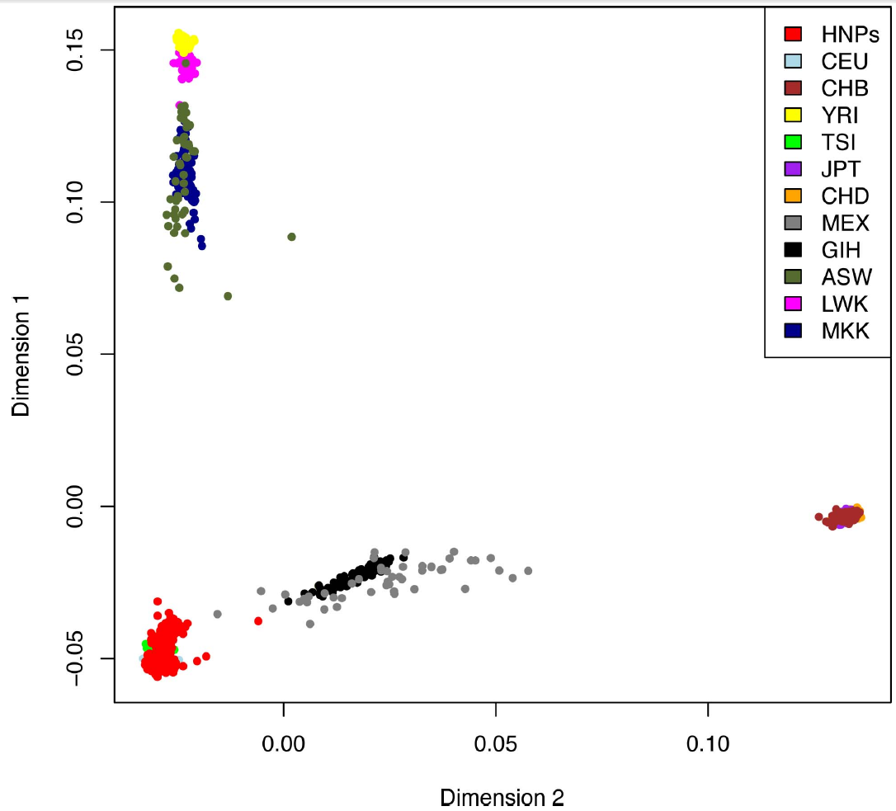

# ENIGMA2 - 1,000 Genomes Cookbook
*Last update November 13, 2013*

(Adapted from the Minimac: 1000 Genomes cookbook)

Please note this protocol was developed for the ENIGMA consortium. If you are 
not part of the ENIGMA consortium and wish to use this protocol please register 
on the ENIGMA mailing list so that we can contact you regarding any updates or 
issues that arise relating to this protocol. You can register at 
http://enigma.ini.usc.edu/members/join/

**If you use data generated by this protocol for non-ENIGMA projects please 
include the following citation for the protocol in your work:**

**ENIGMA2 Genetics Support Team. ENIGMA2 1KGP Cookbook (v3) [Online]. The
Enhancing Neuroimaging Genetics through Meta-Analysis (ENIGMA) Consortium.
http://enigma.ini.usc.edu/wp-content/uploads/2012/07/ENIGMA2_1KGP_cookbook_v3.pdf
[13 November 2013]**

Please let us know if you run into problems along the way

The ENIGMA2 Genetics Support Team (enigma2helpdesk@gmail.com)

-Sarah Medland, Derrek Hibar, Miguel E. Rentería, Alejandro Arias Vasquez and 
Jason Stein

**What’s the difference from the previous version?**

We have fixed a problem with strand flipping and added the X chromosome. In 
addition, we have added step-by-step instructions for completing the 
Multidimensional Scaling (MDS) analysis to be used in the association testing to
control for population substructure (and more generally to help verify the 
reference population your group should use).

**Please note the strand flipping problem affected all chromosomes and had a 
major impact on imputation accuracy. These changes mean that all groups will 
need to rerun the full protocol starting from step 0.**

**What reference set are we using?**

The most recent versions of the 1KGP reference set (phase 1 release v3) contain 
data for 41 million markers, of which ~23 million are monomorphic in Caucasians.
Rather than invest a substantial amount of time imputing and analysing data 
which are going to be redundant, for the ENIGMA2 imputation we have created a 
set of reference files that contain all 13,479,643 genetic variants observed 
more than once in the European populations.

If you want to use an alternate 1KGP reference, ie because you are participating
in another consortium that is asking for the ALL reference or because your 
participants are not of European ancestry please let us know.

**How long will it take to Run?**

Obviously every group has a different server design but we have tested the new 
protocol on the ADNI, QTIM and BIG samples with the following outcomes.

The ADNI sample, which comprised 745 individuals and 540,000 SNPs on the 
Illumina 550k platform. The portion of the protocols for generating MDS plots 
took 7 hours to complete (note that it can sometimes take 12 days to complete in
very large samples). The phasing step took 1.5 days to complete on the LONI 
server (split over 20 nodes with no node allowed more than 8GB of RAM). The 
imputation step took 1 day to complete.

For the QTIM sample, which comprised 838 individuals and 542,000 SNPs on the 
Illumina 610k platform. On the QIMR server the phasing step took ~11 hours to 
complete and the imputation step took ~4 hours to complete per ‘chunk’. This 
pipeline was set to run allowing each ‘chunk’ of the genome was run on its own 
node, when run this way each of the phasing jobs accessed ~2GB of RAM and the 
imputation jobs ~1.5GB of RAM. The combined size of the data produced was ~12GB 
(gz'ed).

The BIG sample included 1303 individuals and 564,000 SNPs on the Affymetrix 6.0 
platform. On the LISA server from the SARA supercomputer facility in Amsterdam, 
the phasing took between 1119 hours to complete per ‘chunk’. Each chunk was set 
to run on its own node accessing ~5GB of RAM. The imputation step needed ~5 
hours per ‘chunk’ and allocated (per node) between 510 GB of RAM.

### Multi-dimensional Scaling (MDS) Protocol

Please note if you ran the MDS Protocol for ENIGMA1 and you have not added *any 
new individuals or new genotyping* you do not need to rerun the MDS analysis!

**The MDS protocol assumes you are using a bash shell.**

**To check which shell you are using on your server type:**

```bash
echo $SHELL
```

**If you are not using bash please change to the bash shell to run the protocol 
by typing:**

```
bash
```

**when you are finished to go back to your usual shell (if you weren’t already 
in bash) type:**

```bash
exit
```

---

**Before we start, you need to download and install some required programs 
(which you may already have). The required programs are: Plink, R, ssh 
client. Links to the download sites are available below. Please 
address any questions to: enigma@lists.loni.ucla.edu.**
*   Plink can be downloaded 
    [here](http://pngu.mgh.harvard.edu/~purcell/plink/download.shtml).
*   R can be downloaded [here](http://cran.stat.ucla.edu/).
*   An ssh client can be downloaded 
    [here](http://www.chiark.greenend.org.uk/~sgtatham/putty/download.html) 
    (though there are many to choose from).
    
**Paste the code below into a terminal window or shell script, substitute the 
correct values where text is italicized.**

Download the customized reference data to your working directory which we will 
call /enigma/genetics/:

<pre>
cd <i>/enigma/genetics/</i>
wget "http://enigma.ini.usc.edu/wp-content/uploads/2012/07/HM3.bed.gz"
wget "http://enigma.ini.usc.edu/wp-content/uploads/2012/07/HM3.bim.gz"
wget "http://enigma.ini.usc.edu/wp-content/uploads/2012/07/HM3.fam.gz"
</pre>

---

Filter SNPs out from your dataset which do not meet Quality Control criteria 
(Minor Allele Frequency < 0.01; Genotype Call Rate < 95%; HardyWeinberg 
Equilibrium < 1x10<sup>-6</sup>). Directions assume your data are in binary 
plink format (bed/bim/fam), if this is not the case try to convert to plink 
format and contact enigma2helpdesk@gmail.com with questions.

<pre>
#replace yourrawdata with the name of the local plink file name
export datafileraw=<i>yourrawdata</i>
plink --bfile $datafileraw --hwe 1e-6 --geno 0.05 --maf 0.01 --noweb \
--make-bed --out ${datafileraw}_filtered
</pre>

---

Unzip the HM3 genotypes. Prepare the HM3 and the raw genotype data by extracting
only snps that are in common between the two genotype data sets this avoids 
exhausting the system memory. We are also removing the strand ambiguous snps 
from the genotyped data set to avoid strand mismatch among these snps. Your 
genotype files should be filtered to remove markers which do not satisfy the 
quality control criteria above.

<pre>
#change directory to a folder with you plink dataset and downloaded HM3 files
cd <i>/enigma/genetics</i>
</pre>

```bash
gunzip HM3*.gz
export datafile=${datafileraw}_filtered #${datafileraw}_filtered should give you
                                        #the name of the local plink file name 
                                        #that has been filtered of SNPs not 
                                        #meeting QC criteria (see above)
awk '{print $2}' HM3.bim > HM3.snplist.txt
plink --bfile ${datafile} --extract HM3.snplist.txt --make-bed --noweb --out \
local
awk '{ if (($5=="T" && $6=="A")||($5=="A" && $6=="T")||($5=="C" && $6=="G")||\
($5=="G" && $6=="C")) print $2, "ambig" ; else print $2 ;}' $datafile.bim \
| grep -v ambig > local.snplist.txt
plink --bfile HM3 --extract local.snplist.txt --make-bed --noweb --out external
```

---

Merge the two sets of plink files – In merging the two files plink will check 
for strand differences. If any strand differences are found plink will crash 
with the following error (ERROR: Stopping due to mis-matching SNPs -- check +/- 
strand?)

Ignore warnings regarding different physical positions

```bash
plink --bfile local --bmerge external.bed external.bim external.fam --make-bed \
--noweb --out HM3merge
```

---

If plink crashed with a strand error (ERROR: Stopping due to mis-matching SNPs \
-- check +/- strand?) run the following two lines of alternate code

```bash
plink --bfile local --flip HM3merge.missnp --make-bed --noweb --out flipped
plink --bfile flipped --bmerge external.bed external.bim external.fam \
--make-bed --noweb --out HM3merge
# this step will take a while (less than 1 hour)
```

---

Run the MDS analysis this -- step will take a while (approx. 1 day)

```bash
plink --bfile HM3merge --cluster --mind .05 --mds-plot 4 --extract \
local.snplist.txt --noweb --out HM3mds
```

---

Plot the MDS results using R into a file called mdsplot.eps and mdsplot.pdf 
(Note: type R to start R in unix and q() followed by n to close the R session 
after the plot has been made)

```bash
awk 'BEGIN{OFS=","};{print $1, $2, $3, $4, $5, $6, $7}' >> HM3mds2R.mds.csv \
HM3mds.mds
#This formats the plink output into an R compatible format.

R
#From this point until the end of the section, you are working in the R 
#statistical package

library(calibrate)
#If you don’t have calibrate package, install it using
#install.packages("calibrate")

mds.cluster = read.csv("HM3mds2R.mds.csv", header=T);
ur.num = length(mds.cluster$C1) 988;
colors = rev(c(rep("red", ur.num), rep("lightblue", 112), rep("brown", 84), 
               rep("yellow", 113),rep("green", 88), rep("purple", 86), 
               rep("orange", 85), rep("grey50", 50), rep("black", 88),
               rep("darkolivegreen", 49), rep("magenta", 90), 
               rep("darkblue", 143)));

pdf(file="mdsplot.pdf",width=7,height=7)

plot(rev(mds.cluster$C2), rev(mds.cluster$C1), col=colors, ylab="Dimension 1",
xlab="Dimension 2",pch=20)
legend("topright", c("My Sample", "CEU", "CHB", "YRI", "TSI", "JPT", "CHD", 
                     "MEX", "GIH", "ASW","LWK", "MKK"), 
       fill=c("red", "lightblue", "brown", "yellow", "green", "purple", 
              "orange", "grey50", "black", "darkolivegreen", "magenta", 
              "darkblue"))

#label your sample points, if you want to know the subject ID label of each 
#sample on the graph, uncomment the value below (this is optional and you can 
#choose not to do this if you are worried about patient information being sent; 
#when you send us your MDS plot please make sure the subject ID labels are NOT 
#on the graph)
#textxy(mds.cluster$C2[1:ur.num], mds.cluster$C1[1:ur.num], 
       #mds.cluster$IID[1:ur.num])
dev.off();
```

---

Please send the newly created mdsplot.pdf and HM3mds2R.mds.csv files to the 
authors of this protocol (Sarah Medland, Jason Stein, Alejandro Arias Vasquez, 
Derrek Hibar, and Miguel Renteria) at the ENIGMA helpdesk: 
enigma2helpdesk@gmail.com.

---

Your output will look something like this when viewed as a PDF file:



### Imputation Protocol

**The imputation cookbook assumes you are using a bash shell.**

**To check which shell you are using on your server type:**

```bash
echo $SHELL
```

**If you are not using bash please change to the bash shell to run the protocol 
by typing:**

```
bash
```

**when you are finished to go back to your usual shell (if you weren’t already 
in bash) type:**

```bash
exit
```

**Step 0: Start downloading the reference data**

The first thing to do is to start downloading the reference data - the hap files
are large (1.1GB) and might take a long time to download. Instructions for 
downloading the ENIGMA2 references are given below.

---

**OPTIONAL: If you would like to download and analyse the full 1KGP data please 
feel free to do so.** The files can be found on the MaCH download page. **Files 
for other ancestries can also be found on that page.** There is some code at the
end of the protocol that might be useful for those using other reference sets.

*Note - You do not need to download the files from the MaCH download page unless
you want to use the full files or those for other ancestries (we already provide
files for samples with European ancestry):*

http://csg.sph.umich.edu//abecasis/MaCH/download/1000G.2012-03-14.html

---

To use the ENIGMA2 (EUR) references download the files using the following code.
Note these references files contain autosomal and non-psuedo-autosomal X 
chromosome data:

```bash
mkdir 1KGPref
cd 1KGPref
wget "http://enigma.ini.usc.edu/wp-content/uploads/2012/07/\
v3.20101123.ENIGMA2.EUR.20120719.vcf.tgz"
wget "http://enigma.ini.usc.edu/wp-content/uploads/2012/07/\
v3.20101123.ENIGMA2.EUR.20120719.extras.tgz"
tar -zxvf v3.20101123.ENIGMA2.EUR.20120719.vcf.tgz
tar -zxvf v3.20101123.ENIGMA2.EUR.20120719.extras.tgz
```

---

**Step 1: Converting SNP ids to rs numbers ***this might not apply to your 
data*****

this protocol): If your SNP data is stored under proprietary names ie SS9999 or 
AFFY999999 you will need to update the SNP identifiers to rs numbers in the .bim
file prior to running these filters. You will first need to create or obtain a 
key for mapping your proprietary SNP names to rs-numbers.

For the Affy 6.0 chipset we have a pre-made file found
[here](http://enigma.ini.usc.edu/wp-content/uploads/2012/04/GRCh37_hg19_AffyID2rsnumbers.txt).

If you have another chip platform you may need to contact your vendor to find 
the appropriate key file for mapping proprietary SNP names to rs-numbers. Those 
with Affy chips may be able to find information [here]
(https://www.affymetrix.com).

Select “Support” → “Affymetrix Microarray Solution”

Select your platform from the drop down menu and click the box for “Annotation 
Files”

Download the appropriate annotation file under the heading “Current NetAffx 
Annotation Files”

You will probably need to reformat the annotation data into a proper key file. 
You can download the example file for the Affy 6.0 chip above to get an idea of 
how the key file should look. In general, the format of key file includes two 
columns, the first with your SNPID (SS9999 or AFFY999999), the second with the 
rs number (no header):

```
SNP_A1780419
rs6576700
...
```

Assuming that you are using the Affy 6.0 key file provided or that you have made
the proper key file for your chipset, run the following code customising the 
**bolded** sections.

<pre>
wget "<b>http://enigma.ini.usc.edu/wp-content/uploads/2012/04/GRCh37_hg19_AffyID2rsnumbers.txt</b>"
awk '{print $2, $1, $3, $4, $5, $6}' <b>datfile-with-affyID.bim</b> > temp.bim
awk 'FNR==NR{a[$1]=$2;next} $1 in a {print a[$1], $2, $3, $4}'
GRCh37_hg19_AffyID2rsnumbers.txt temp.bim > predatfile.bim
awk '{print $2, $1, $3, $4, $5, $6}' predatfile.bim > <b>datafile.bim</b>
</pre>

**Step 2: re-QC’ing the data**

Before starting the imputation process you need to drop any strand ambiguous 
SNPs and rescreen for low MAF, missingness and HWE in your PLINK-format genotype
files. Copy your PLINK-format genotype files (\*.bed, \*.bim, \*.fam, files into 
the 1KGPref/ directory) and then run the following code customising the 
**bolded** sections.

<pre>
awk '{ if (($5=="T" && $6=="A")||($5=="A" && $6=="T")||($5=="C" && $6=="G")||\
($5=="G" && $6=="C")) print $2, "ambig" ; else print $2 ;}' \
<b>datafile.bim</b> | grep ambig | awk '{print $1}' > ambig.list

plink --bfile <b>datafile</b> --exclude ambig.list --make-founders --out lastQC \
--maf 0.01 --hwe 0.000001 --make-bed --noweb
</pre>

**After modifying the SNP identifiers and running the last command, you might 
encounter duplicate markers, you need to remove those before going on (you can 
copy the SNP names from the log file created into a text file called 
duplicated.list). If there are no duplicate SNPs you may skip this step:**

```
plink --bfile lastQC --exclude duplicated.list --make-founders --out lastQC2 \
--maf 0.01 --hwe 0.000001 --make-bed --noweb
```

**Step 3: Shifting your data to build 37 & flipping strand**

In most GWAS data sets, the SNP names and positions were stored using the 
positions in NCBI build 36 (UCSC hg 18). The HapMap data were also stored using 
this build. The 1000 Genomes Project (1KGP) data is named and stored using NCBI 
build 37 (UCSC hg 19). In practical terms there are a number of differences 
between the two builds. Three main types of problems have been identified in 
build36 that have been addressed or resolved in build37:
*   some SNPs were found to be listed twice under two different rs numbers
*   some SNPs were found to be mapped to the wrong chromosome
*   numerous SNPs have been found to map to the wrong location (but are on the 
    correct chromosome)
    
To convert your data from build36 to build37 you are going to remap your SNP 
positions to the positions listed in the 1KGP using the following code. There 
are a small number of SNPs (312) in the 1KGP references that map to more than 
one chromosome so we want to drop these before proceeding. The following code 
downloads the 1KGP map and constructs the lists that will be used to filter the 
genotyped data prior to phasing. We are also flipping strand at this step so 
that your genotype data is aligned to the reference prior to phasing. The 
1kgp.chr 1kgp.bp 1kgp.snps and 1kgp.alleles files are included in the tgz file 
that you have downloaded from the ENIGMA site.

---

<pre>
# For the following commands in green use the clean “lastQC2” files if you had 
# to remove duplicate markers
# Join the genotyped bim file with the reference allele lists
# reformat the lastQC.bim file
awk '{print $2,$1,$3,$4,$5,$6}' <b>lastQC</b>.bim > tempQC.bim

# Join the two files
awk 'NR==FNR{s=$1;a[s]=$0;next} a[$1]{print $0 " "a[$1]}' \
tempQC.bim 1kgp.alleles > merged.alleles

# selects SNPS showing different alleles in the two files
awk '{ if ($2!=$8 && $2!=$9) print $1}' merged.alleles > flip.list
plink --bfile <b>lastQC</b> --extract 1kgp.snps --update-map 1kgp.chr \
--update-chr --flip flip.list --make-bed --out temp --noweb
</pre>

```bash
plink --bfile temp --update-map 1kgp.bp --geno 0.05 --mind 0.05 --make-bed \
--out lastQCb37 --noweb

wc -1 lastQCb37.bim

## Make list of males and females for writing out the X chromosome
awk '{ if($5==1) print $1, $2}' lastQCb37.fam > male.list
awk '{ if($5==2) print $1, $2}' lastQCb37.fam > female.list

##Check that your dataset is properly split by gender by opening male.list and 
##female.list in a text editor. Also check that total numbers make sense.
wc -1 female.list
wc -1 male.list
```

After these filters the line-count of the bim file (ie the last command on the 
list) should hopefully still have ~90% of the SNPs that you originally 
genotyped. If you have lost a lot of SNPs during the QC and filtering or you are
left with less than 300,000 SNPs please double check the logs and see if you can
identify which step is causing problems.

**Step 4: Splitting the genotyped data into chromosomes**

Here we write out the autosomal data and the female X chromosome data ready for 
phasing. Because the male X chromosome data does not need to be phased it will 
be written out after the chunk chromosome set has been run for females.

```bash
mkdir Mach
echo "Starting to split the lastQC file"
for i in {1..22}
do
echo "plink --bfile lastQCb37 --chr "$1" --recode --noweb --out \
Mach/ready4mach."$1"" >> plink_writeout.sh
done
echo "plink --bfile lastQCb37 --chr 23 --set-hh-missing --keep male.list \
--recode --noweb --out Mach/ready4mach.23.male" >> plink_writeout.sh
echo "plink --bfile lastQCb37 --chr 23 --keep female.list --recode --noweb \
--out Mach/ready4mach.23.female" >> plink_writeout.sh
chmod +x plink_writeout.sh
./plink_writeout.sh
mv Mach/ready4mach.23.female.map Mach/ready4mach.23.map
rm Mach/ready4mach.23.male.map
```

**Step 5: Reformating the dat files**

The dat files need to be reformatted, then the files are zipped and a shell 
script is written to run the phasing (please copy the complete code and paste it
in the prompt window and hit enter).

```bash
echo "Reformating dat files & "
# loop over chromosomes
for i in {1..23}
do
echo "Working on chromosome $i "
#tell MaCH to skip the phenotype that Plink includes by default
echo "S dummy" > Mach/ready4mach."$i".dat
# reformat the map file to make a merlin dat file in which the SNP are named as 
#chromosome:position format
awk '{ print "M", $1 ":" $4}' Mach/ready4mach."$i".map >>
Mach/ready4mach."$i".dat
gzip Mach/ready4mach."$i".dat
done
gzip Mach/ready4mach.*.ped
```

**Step 6: Chunking the chromosomes & phasing**

We then ‘chunk’ dat files, splitting the chromosomes into pieces and write a 
script to start the phasing. But first you need to download and install the 
ChunkChromosome program in order to accurately and effectively split genotype 
data into manageable blocks.

Before running the phasing you need to download the newest version of MaCH and
ChunkChromosome add it to your path if these programs are not already available 
on your server. If you need to install the programs we would recommend that you 
make a directory called `bin` in your home area and place the programs there.

The download page for the newest version of the MaCH software (version 1.0.18) 
is found here:

```bash
wget "http://www.sph.umich.edu/csg/abecasis/MaCH/download/mach.1.0.18.Linux.tgz"
tar -zxvf mach.1.0.18.Linux.tgz
```

If the link above does not work it probably means there is a new
version of MaCH available, you can check that by pointing your
browser [here](http://www.sph.umich.edu/csg/abecasis/MaCH/download/).

Make sure that the “mach1” executable that you just downloaded is added to your 
path. So that when you type “which mach1” (without the quotes) in your command 
line it gives you the full path to the newest mach1 executable that you just 
downloaded.

The download page for ChunkChromosome is found here:

```bash
wget "http://www.sph.umich.edu/csg/cfuchsb/\
generic-ChunkChromosome-2012-08-28.tar.gz"
```

If the link above does not work it probably means there is a new version of 
ChunkChromosome available, you can check that by pointing your browser 
[here](http://genome.sph.umich.edu/wiki/ChunkChromosome).

Once you have downloaded ChunkChromosome you need to install it using the 
following commands. Make sure that the “ChunkChromosome” executable that you 
just installed is added to your path. So that when you type “which 
ChunkChromosome” (without the quotes) in your command line it gives you the full
path to the executable.

```bash
tar -zxvf genericChunkChromosome2012-08-28.tar.gz
cd genericChunkChromosome/
make
make install INSTALLDIR="${PWD}/ChunkChromosome"
cd ../Mach/
```

Copy the full block of code below directly into the command line

```bash
echo "Writing scripts to run phasing in MaCH"
echo "#Script for running phasing in MaCH" > MaCH_phasing.sh
for i in {1..23}
do
ChunkChromosome -d ready4mach."$i".dat.gz -n 5000 -o 500
done
```

<pre>
#loop over parts
<i>for ((j=1; j<=40; j++))</i>
</pre>

```bash
do
for i in {1..22}
do
if test -f chunk"$j"-ready4mach."$i".dat.gz
then
echo "mach1 -d chunk"$j"-ready4mach."$i".dat.gz -p ready4mach."$i".ped.gz \
--prefix chunk"$j"-ready4mach."$i" --rounds 20 --states 200 --phase > \
chunk"$j"-ready4mach."$i".mach.log" >> MaCH_phasing.sh
fi
done
if test -f chunk"$j"-ready4mach.23.dat.gz
then
echo "mach1 -d chunk"$j"-ready4mach.23.dat.gz -p ready4mach.23.female.ped.gz 
--prefix chunk "$j"-ready4mach.23.female --rounds 20 --states 200 \
--phase > chunk"$j"-ready4mach.23.female.mach.log" >>MaCH_phasing.sh
fi
done
```

Your data are now ready to phase and the commands for running the phasing have 
been written to `MaCH_phasing.sh`.

At this stage you will need to customise the script for your server/queuing 
system. The aim is to run as many of these commands in parallel as possible. If 
possible try any run the phasing analyses on 64bit nodes with at as much ram as 
possible (try to use at least 4GB). The files being generated will be zipped as 
they are produced to help preserve space.

**Mach may generate a series of temporary files which include the word “prelim” 
in the file name these can be deleted as the analysis progresses.**

**Step 7: Setting up the Male X chromosome data for imputation**

The male X chromosome data do not need to be phased. However we do need to 
restructure the data so that they are ready for imputation.

```bash
cd /1KGPrefs/Mach/

zless ready4mach.23.male.ped.gz | awk '{ printf "%s", $1 "->"$2 "HAPLO1 "; \
for(N=7; N<=NF; N+=2) printf "%s", $N; printf "\n"; printf "%s", $1 "->"$2 \
"HAPLO2 "; for(N=7; N<=NF; N+=2) printf "%s", $N; printf "\n";}' > \
ready4mach.23.male
gzip ready4mach.23.male
```

**Step 8: Imputation**

The next step is to run your imputation. After running this section of code you 
will have a shell script containing the commands needed for imputing the 1KGP 
variants (`MiniMac-impute.sh`). Once again, at this stage you will need to 
customise the script for your server/queuing system. The command will produce 5 
files per chunk (.dose .rec .erate .info and .log) you can archive/zip the .rec 
and .erate files as you are unlikely to need them unless something has gone 
wrong. You are likely to have around 100 chunks in your genotype data.

Before running the imputation you need to download the newest version of minimac
and add it to your path. The download page for minimac is here:

```bash
wget "http://www.sph.umich.edu/csg/cfuchsb/minimac-beta-2013.7.17.tgz"
tar -zxvf minimac-beta-2013.7.17.tgz
```

If the link above does not work it probably means there is a new version of 
ChunkChromosome available, you can check that by pointing your browser 
[here](http://www.sph.umich.edu/csg/cfuchsb/).

Make sure that the “minimac” executable that you just downloaded is added to 
your path. So that when you type “which minimac” (without the quotes) in your 
command line it gives you the full path to the newest minimac executable that 
you just downloaded.

```bash
cd /1KGPrefs/Mach/
echo "# Imputation step" > MiniMac-impute.sh

#loop over parts
for ((j=1; j<=40; j++))
do
# Impute into phased haplotypes
for i in {1..22}
do
if test -f chunk"$j"-ready4mach."$i".dat.gz
then
echo "minimac --vcfReference --rounds 5 --states 200 --refHaps \
../chr"$i".phase1_release_v3.20101123.snps_indels_svs.genotypes.refpanel.\
EUR.nosingles.vcf.gz --haps chunk"$j"-ready4mach."$i".gz --snps chunk"$j"\
-ready4mach."$i".dat.gz.snps --autoClip autoChunk-ready4mach."$i".dat.gz \
--gzip --prefix chunk"$j"-ready4mach."$i".imputed > chunk"$j"-ready4mach.\
"$i"-minimac.log" >> MiniMac-impute.sh
fi
done
if test -f chunk"$j"-ready4mach.23.dat.gz
then
echo "minimac --vcfReference --round 5 --states 200 --refHaps \
../chr23.phase1_release_v3.20101123.snps_indels_svs.genotypes.refpanel.EUR.\
nosingles.vcf.gz --haps chunk"$j"-ready4mach.23.female.gz --snps chunk"$j"\
-ready4mach.23.dat.gz.snps --autoClip autoChunk-ready4mach.23.dat.gz \
--gzip --prefix chunk"$j"-ready4mach.23.female.imputed > chunk"$j"\
-ready4mach.23.female-minimac.log" >> MiniMac-impute.sh
cat chunk"$j"-ready4mach.23.dat.gz.snps >> temp.23.dat.gz.snps
fi
done
awk '!x[$0]++' temp.23.dat.gz.snps > ready4mach.23.dat.gz.snps
echo "minimac --vcfReference --round 5 --states 200 --refHaps \
../chr23.phase1_release_v3.20101123.snps_indels_svs.genotypes.refpanel.EUR.\
nosingles.vcf.gz --haps ready4mach.23.male.gz --snps ready4mach.23.dat.gz.\
snps --gzip --prefix ready4mach.23.male.imputed > \
ready4mach.23.male-minimac.log" >> MiniMac-impute.sh
```

Mach will generate a series of temporary files which include the word “draft” 
in the file name these can be deleted after the imputation has finished.

Please let us know if you run into problems along the way

The ENIGMA Support Team (enigma2helpdesk@gmail.com)

**Additional code for samples using non EUR reference data**

Reference data for non EUR samples can be downloaded from the MaCH download page
http://www.sph.umich.edu/csg/abecasis/MaCH/download/1000G.2012-03-14.html . We 
would advise groups who are choosing to use other references to use the the 
version of the ‘ethnicities’ reference set prepared by the GIANT consortium 
which does not include monomorphic or singleton variants.

To shift your data to build 37 and align your data with your chosen reference 
you would run the following code and substitute these files for those listed 
above:

```bash
for ((i=1;i<=22;i++))
do
awk ‘{print $3, $1, $2, $4, $5}’
chr”$i”.phase1_release_v3.20101123.snps_indels_svs.genotypes.refpanel.ALL.vcf.\
gz | grep ^rs >> temp.rs
done

awk '{print $1, $2}' temp.rs | awk '!x[$1]++' > 1kgp.chr
awk '{print $1, $3}' temp.rs | awk '!x[$1]++' > 1kgp.bp
awk '{print $1, $4, $5}' temp.rs | awk '!x[$1]++' > 1kgp.alleles
awk '{print $1}' temp.rs | sort -u > 1kgp.snps
```
